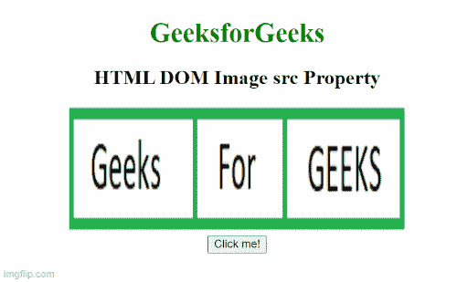
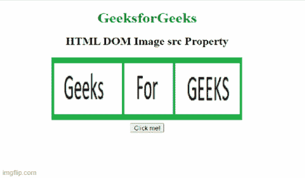

# HTML DOM 图像 src 属性

> 原文:[https://www.geeksforgeeks.org/html-dom-image-src-property/](https://www.geeksforgeeks.org/html-dom-image-src-property/)

[**HTML**](https://www.geeksforgeeks.org/html-tutorials/)**DOM Image src 属性**用于设置或返回< img >元素的 src 属性的值。此属性用于指定图像的网址。

**语法:**

*   返回图像 src 属性。

    ```html
    imageObject.src
    ```

*   设置图像 src 属性。

    ```html
    imageObject.src = URL
    ```

**属性值:**它包含一个单值 URL，指定嵌入到图像中的文档的 URL。下面列出了两种类型的网址链接:

*   **绝对 URL:** 指向另一个网页。
*   **相对 URL:** 指向同一网页的其他文件。

**返回值:**返回一个代表图像网址的字符串值。

**示例:**下面的代码返回 src 属性。

## 超文本标记语言

```html
<!DOCTYPE html>
<html>

<body>
    <center>
        <h1 style="color: green">
            GeeksforGeeks
        </h1>

        <h2>HTML DOM Image src Property</h2>

        
        <br>

        <button onclick="Geeks()">
            Click me!
        </button>

        <p id="sudo"></p>

    </center>

    <script>
        function Geeks() {
            var g = document.getElementById("GFG").src;
            document.getElementById("sudo").innerHTML = g;
        }
    </script>
</body>

</html>
```

**输出:**



**示例 2:** 本示例设置 src 属性。

## 超文本标记语言

```html
<!DOCTYPE html>
<html>

<body>
    <center>
        <h1 style="color: green">GeeksforGeeks</h1>
        <h2>HTML DOM Image src Property</h2>
        
        <br>
        <button onclick="Geeks()">Click me!</button>
        <p id="sudo"></p>

    </center>

    <script>
        function Geeks() {
          var g = document.getElementById("GFG").src =
"https://media.geeksforgeeks.org/wp-content/uploads/20210915115837/gfg3-300x300.png"
            document.getElementById("sudo").innerHTML = g;
        }
    </script>

</body>

</html>
```

**输出:**



**支持的浏览器:**

*   谷歌 Chrome
*   火狐浏览器
*   微软公司出品的 web 浏览器
*   歌剧
*   苹果 Safari