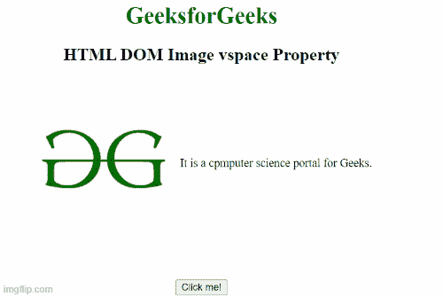

# HTML DOM 图像空间属性

> 原文:[https://www . geesforgeks . org/html-DOM-image-vspace-property/](https://www.geeksforgeeks.org/html-dom-image-vspace-property/)

**HTML DOM 图像空间属性**用于设置或返回图像元素的**空间**属性的值。 **vspace** 属性用于指定图像底部和顶部的空白数量。

**语法**

它返回 image vspace 属性。

```html
ImageObject.vspace; 
```

它设置 image vspace 属性。

```html
ImageObject.vspace="pixels";
```

**属性值:**它包含值，即**像素**，表示图像底部和顶部的空白区域数量。

**示例 1:** 本示例返回 vspace 属性。

## 超文本标记语言

```html
<!DOCTYPE html>
<html>

<body>
    <center>
        <h1 style="color: green">
            GeeksforGeeks
        </h1>

        <h2>HTML DOM Image vspace Property</h2>

<p>
            It is a computer science portal for Geeks.
        </p>

        <br>

        <button onclick="Geeks()">
            Click me!
        </button>

        <p id="sudo"></p>

    </center>

    <script>
        function Geeks() {
            var g = document.getElementById("GFG").vspace;
            document.getElementById("sudo").innerHTML = g + "px";
        }
    </script>
</body>

</html>
```

**输出:**



**示例 2:** 本示例设置图像空间属性。

## 超文本标记语言

```html
<!DOCTYPE html>
<html>

<body>
    <center>
        <h1 style="color: green">
            GeeksforGeeks
        </h1>

        <h2>HTML DOM Image vspace Property</h2>

<p> 
            It is a computer science portal for Geeks.
        </p>

        <br>

        <button onclick="Geeks()">
            Click me!
        </button>

        <p id="sudo"></p>

    </center>

    <script>
        function Geeks() {
            var g = document.getElementById("GFG").vspace = "5";
            document.getElementById("sudo").innerHTML = g + "px";
        }
    </script>
</body>

</html>
```

**输出:**


**支持的浏览器:**

*   谷歌 Chrome
*   微软公司出品的 web 浏览器
*   歌剧
*   火狐浏览器
*   苹果 Safari