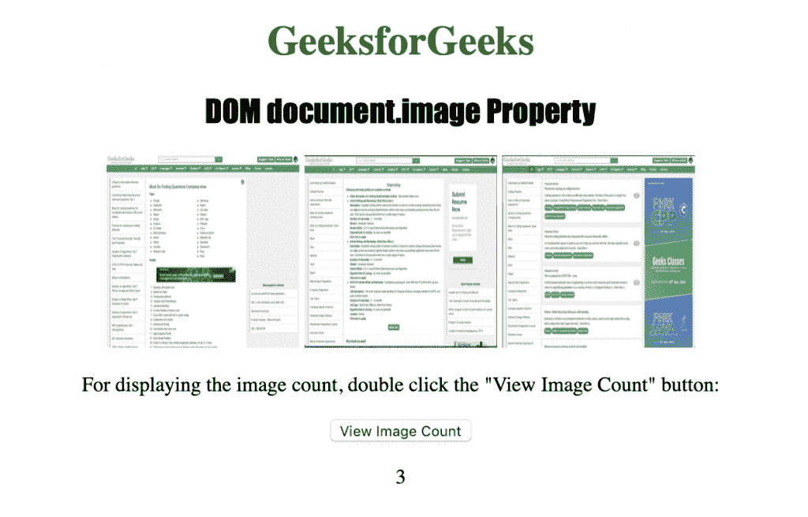
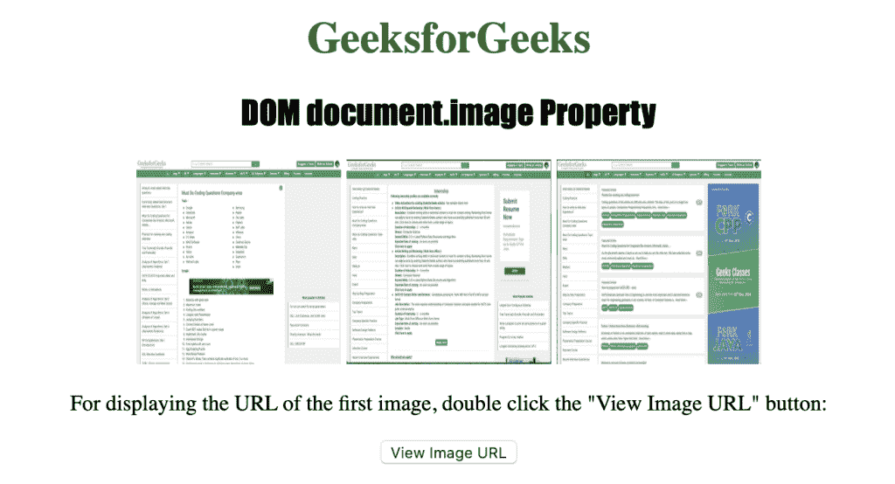
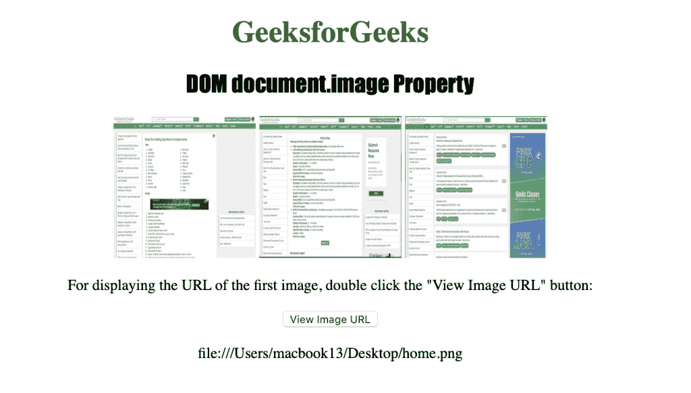
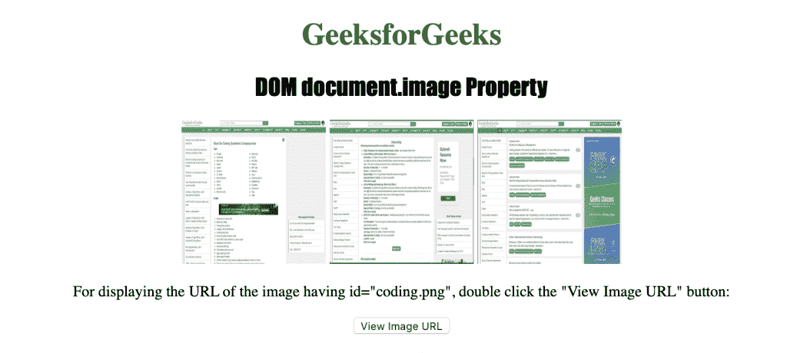
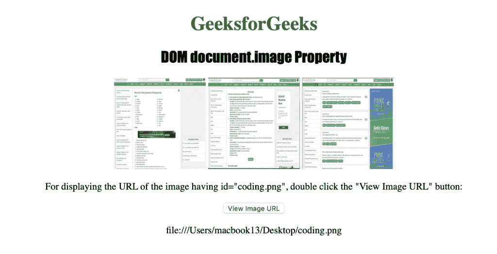

# HTML | DOM 图片收藏属性

> 原文:[https://www . geesforgeks . org/html-DOM-images-collection-property/](https://www.geeksforgeeks.org/html-dom-images-collection-property/)

HTML 中的**图像集合属性**用于返回文档中< img >元素的集合。它可以用于知道使用< img >标签插入到文档中的图像的数量。类型=图像的<输入>元素不计入图像属性。
**语法:**

```html
document.images
```

**属性:**返回集合中< img >元素的个数。
**方法:**DOM 图像集合包含以下三种方法:

*   **【索引】:**用于返回选中索引的元素。索引值以 0 开始。如果索引值超出范围，则返回空值。
*   **项(索引):**用于返回所选索引的< img >元素。索引值以 0 开始。如果索引值超出范围，则返回空值。
*   **name item(id):**用于返回集合中给定 id 属性的< img >元素。如果 id 无效，它将返回 NULL。

***返回值:**一个 HTMLColl* 检查对象，代表文档中的所有< img >元素。集合中的元素按照它们在源代码
中出现的方式排序？？？？下面的程序说明了 HTML 中的 document.image 属性:
**示例 1:** 使用 length 属性返回集合中< img >元素的个数。

## 超文本标记语言

```html
<!DOCTYPE html>
<html>

<head>
    <title>
      DOM document.image() Property
    </title>
    <style>
        h1 {
            color: green;
        }

        h2 {
            font-family: Impact;
        }

        body {
            text-align: center;
        }
    </style>
</head>

<body>
    <h1>GeeksforGeeks</h1>
    <h2>DOM document.image Property</h2>
    
    
    

<p>
      For displaying the image count, double
      click the "View Image Count" button:
    </p>

    <button ondblclick="myImage()">
      View Image Count
    </button>
    <p id="image"></p>

    <script>
        function myImage() {
            var i = document.images.length;
            document.getElementById("image").innerHTML = i;
        }
    </script>
</body>

</html>
```

**输出:**



**示例 2:** 使用 URL 属性返回集合中第一个< img >元素的 URL。

## 超文本标记语言

```html
<!DOCTYPE html>
<html>

<head>
    <title>
      DOM document.image() Property
    </title>
    <style>
        h1 {
            color: green;
        }

        h2 {
            font-family: Impact;
        }

        body {
            text-align: center;
        }
    </style>
</head>

<body>
    <h1>GeeksforGeeks</h1>
    <h2>DOM document.image Property</h2>
    
    
    

<p>
      For displaying the URL of the first image,
      double click the "View Image URL" button:
    </p>

    <button ondblclick="myImage()">
      View Image URL
    </button>
    <p id="image"></p>

    <script>
        function myImage() {
            var i = document.images[0].src;
            document.getElementById("image").innerHTML = i;
        }
    </script>
</body>

</html>
```

**输出:**



**点击按钮后:**



**示例 3:** 使用 nameditem 属性返回集合中< img >元素的 URL。

## 超文本标记语言

```html
<!DOCTYPE html>
<html>

<head>
    <title>
      DOM document.image() Property
    </title>
    <style>
        h1 {
            color: green;
        }

        h2 {
            font-family: Impact;
        }

        body {
            text-align: center;
        }
    </style>
</head>

<body>
    <h1>GeeksforGeeks</h1>
    <h2>DOM document.image Property</h2>
    
    
    

<p>
      For displaying the URL of the image having id="coding.png",
      double click the "View Image URL" button:
    </p>

    <button ondblclick="myImage()">View Image URL</button>
    <p id="image"></p>

    <script>
        function myImage() {
            var i = document.images.namedItem("coding.png").src;
            document.getElementById("image").innerHTML = i;
        }
    </script>
</body>

</html>
```

**输出:**



**点击按钮后:**



**支持的浏览器:**T2 DOM 影像收藏属性支持的浏览器如下:

*   谷歌 Chrome
*   微软公司出品的 web 浏览器
*   火狐浏览器
*   歌剧
*   旅行队