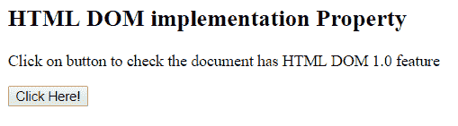
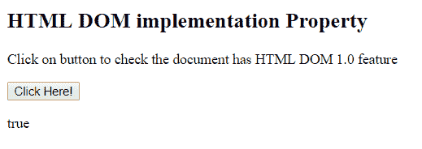
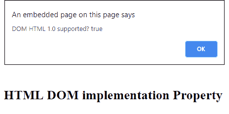

# HTML | DOM 实现属性

> 原文:[https://www . geesforgeks . org/html-DOM-implementation-property/](https://www.geeksforgeeks.org/html-dom-implementation-property/)

HTML 中的 **DOM 实现属性**用于返回与当前文档关联的 domiimplementation 对象。DOMImplementation 是表示提供不依赖于任何特定文档的对象的方法的接口。

**语法:**

```html
document.implementation
```

**返回值:**返回文档实现对象。

**例 1:**

```html
<!-- HTML code to check the document
has HTML DOM 1.0 feature -->
<!DOCTYPE html>
<html>
    <head>
        <title>
            HTML DOM implementation Property
        </title>

        <script>
            function DomFunction() {
                var obj = document.implementation;
                document.getElementById("demo").innerHTML 
                    = obj.hasFeature("HTML", "1.0");
            }
        </script>
    </head>

    <body>
        <h2>HTML DOM implementation Property</h2>

        <p>Click on button to check the document
        has HTML DOM 1.0 feature</p>

        <button onclick = "DomFunction()">
            Click Here!
        </button>

        <p id = "demo"></p>
    </body>
</html>                    
```

**输出:**
**点击按钮前:**

**点击按钮后:**


**例 2:**

```html
<!DOCTYPE html>
<html>
    <head>
        <title>
            HTML DOM implementation Property
        </title>
    </head>

    <body>
        <h2>HTML DOM implementation Property</h2>
        <script>
            var DOM_Name = "HTML";
            var DOM_Ver = "1.0";
            var GFG = document.implementation.hasFeature( 
                        DOM_Name, DOM_Ver);

            alert( "DOM " + DOM_Name + " " + DOM_Ver 
                + " supported? " + GFG );
        </script>
    </body>
</html>                                
```

**输出:**


**支持的浏览器:***DOM 实现属性*支持的浏览器如下:

*   谷歌 Chrome
*   微软公司出品的 web 浏览器
*   火狐浏览器
*   歌剧
*   旅行队