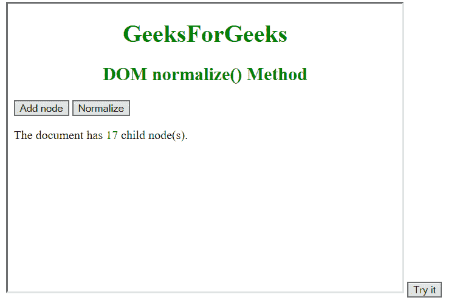
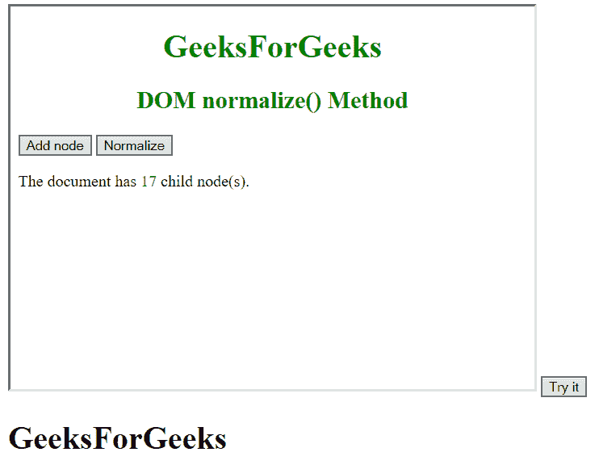

# HTML | DOM importNode()方法

> 原文:[https://www.geeksforgeeks.org/html-dom-importnode-method/](https://www.geeksforgeeks.org/html-dom-importnode-method/)

**HTML | DOM importNode()方法**从另一个文档创建一个节点的副本，并将其导入到当前文档中。

**语法:**

```html
document.importNode(externalNode, [deep])

```

**参数:**

*   **外部节点:**我们需要从另一个文档导入的节点，可以是任何类型。
*   **【深度】:**如果要复制节点及其属性和子节点，我们可以将其值设置为**“真”**；如果只想复制节点及其属性，我们可以设置为**“假”**。如果我们没有指定任何参数，那么 **deep** 的值默认为**“true”**。

**示例-1:**

```html
<!DOCTYPE html>
<html>

<body>

    <!-- iframe is used to create a new frame inside
     our current document and merge another document into it-->
    <!-- you can put your own source in iframe src -->
    <iframe src="D:\Normalize() Method\Normalize.html" 
            style="height:380px;width:520px;"></iframe>

    <button onclick="myNode()">Try it</button>

    <script>
        function myNode() {

            // accessing the iframe using frame variable
            var frame = document.getElementsByTagName("IFRAME")[0]

            // here we are accessing the <h1> element from 
            // the document contained inside the iframe.
            var geek = 
                frame.contentWindow.document.getElementsByTagName("H1")[0];

            // applying importNode() method adding 
            //imported node to our original document.
            var gfg = document.importNode(geek, true);
            document.body.appendChild(gfg);
        }
    </script>

</body>

</html>
```

**输出:**
**前:**


**之后:**


**示例-2:**

```html
<!DOCTYPE html>
<html>

<body>

    <iframe src="D:\HTML nodeClone().html" 
            style="height:380px;width:520px;"></iframe>

    <button onclick="myImport()">Try it</button>

    <script>
        function myImport() {
            var frame = document.getElementsByTagName("IFRAME")[0]

            // here we are accessing the <div> element from the document 
            //contained inside the iframe
            var geek = 
                frame.contentWindow.document.getElementsByTagName("DIV")[0];

            var gfg = document.importNode(geek, true);
            document.body.appendChild(gfg);
        }
    </script>

</body>

</html>
```

**输出:**
**前:**


**之后:**


**注意:** Internet explorer 8 及更早版本不支持 **importNode()** 方法。

**支持的浏览器:**支持 **HTML|DOM importNode()** 方法的浏览器如下。

*   谷歌 Chrome
*   微软公司出品的 web 浏览器
*   火狐浏览器
*   歌剧
*   旅行队