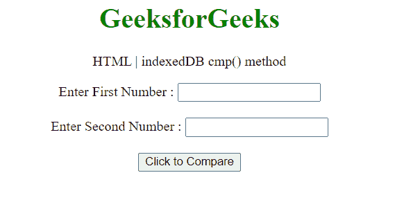
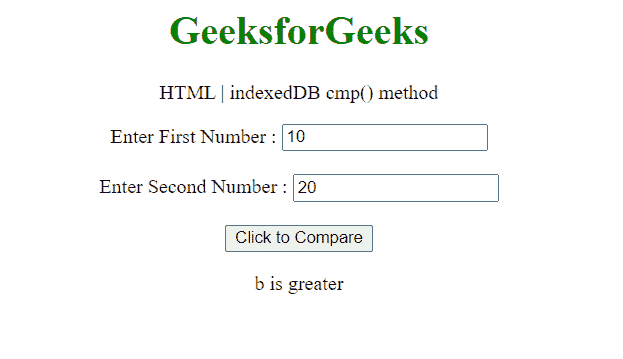

# HTML DOM indexedDB cmp()方法

> 原文:[https://www . geesforgeks . org/html-DOM-indexed db-CMP-method/](https://www.geeksforgeeks.org/html-dom-indexeddb-cmp-method/)

**indexedDB cmp()** 方法用于将两个值作为关键字进行比较，以确定是否相等以及进一步 indexedDB 操作的顺序。
**语法:**

```html
var result = indexedDB.cmp(key1, key2);
```

**参数:**

*   **键 1:** 比较的第一个键。
*   **键 2:** 比较的第二个键。

**返回值:**返回一个整数，表示比较的结果。

| 回收价值 | 描述 |
| -1 | 键 1 |
| Zero | 键 1 =键 2 |
| one | 键 1 >键 2 |

**示例:**在本例中，我们将使用此方法比较两个键。

```html
<!DOCTYPE HTML> 
<html>  
<head>
    <title>indexedDB cmp() method</title>
</head>   
<body style="text-align:center;">
    <h1 style="color:green;">  
        GeeksforGeeks  
    </h1> 
    <p> 
    HTML | indexedDB cmp() method
    </p>
    Enter First Number : 
      <input type="number" id="fir"><br><br>
    Enter Second Number :  
      <input type="number" id="sec"><br><br>
    <button onclick = "Geeks()">
    Click to Compare
    </button>
    <p id="a"> 
    </p>       
    <script> 
        var a = document.getElementById("a");
        function Geeks() {
            var fir = 
             document.getElementById("fir").value;
            var sec = 
             document.getElementById("sec").value;
            var result = window.indexedDB.cmp(fir, sec);
            if(result==0){
                a.innerHTML = "Both are equal";
            }
            else if(result==1){
                a.innerHTML = "a is greater";
            }
            else{
                a.innerHTML = "b is greater";
            }

        } 
    </script> 
</body>   
</html>
```

**输出:**
**按钮点击前:**


**按钮点击后:**


**支持的浏览器:**

*   谷歌 Chrome
*   边缘
*   火狐浏览器
*   旅行队
*   歌剧
*   互联网浏览器(部分支持)