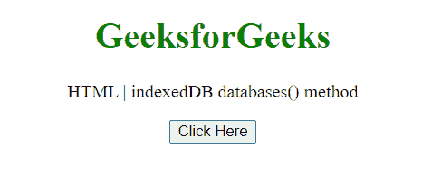
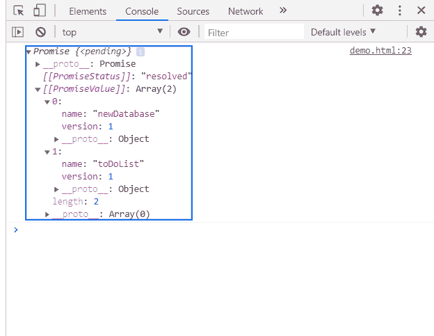

# HTML DOM indexedDB 数据库()方法

> 原文:[https://www . geesforgeks . org/html-DOM-indexed db-databases-method/](https://www.geeksforgeeks.org/html-dom-indexeddb-databases-method/)

indexedDB 接口的 **databases()** 方法返回一个表示文档中所有可用数据库的列表，以及它们的名称和版本。

**语法:**

```html
dbs = indexedDB.databases();
```

**参数:**该方法不取任何参数。
**返回值:**这个方法返回一个包含字典列表的承诺，每个字典有两个元素，名字和版本。
**示例:**在本例中，我们将打开一个数据库，因此，将使用此方法获取数据库。

```html
<!DOCTYPE HTML> 
<html>  
<head>
    <title>indexedDB databases() method</title>
</head>   
<body style="text-align:center;">
    <h1 style="color:green;">  
        GeeksforGeeks  
    </h1> 
    <p> 
    HTML | indexedDB databases() method
    </p>
    <button onclick = "Geeks()">
    Click Here
    </button>   
    <script> 
        function Geeks(){
         var request = 
           window.indexedDB.open("newDatabase", 1);
         console.log(window.indexedDB.databases())
     }
  </script> 
</body>   
</html>
```

**输出:**

**按钮点击前:**



**按钮点击后:**在控制台，可以看到承诺。



**支持的浏览器:**

*   谷歌 Chrome
*   边缘
*   火狐浏览器
*   旅行队
*   歌剧