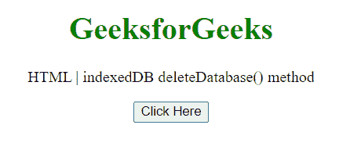
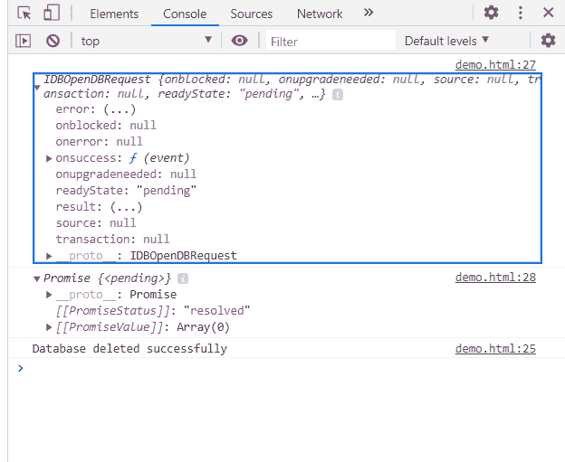

# HTML DOM indexed db delete database()方法

> 原文:[https://www . geesforgeks . org/html-DOM-indexed db-delete database-method/](https://www.geeksforgeeks.org/html-dom-indexeddb-deletedatabase-method/)

**indexed db delete DatabaSe()**方法用于请求删除数据库。该方法立即返回一个 IDBOpenDBRequest 对象，并异步执行删除操作。

**语法:**

```html
var request = indexedDB.deleteDatabase(name);
```

**参数:**

*   **名称:**要删除的数据库的名称。

**返回值:**删除后的一个 IDBOpenDBRequest 对象。

**示例:**在本例中，我们将打开一个数据库，因此将使用此方法删除该数据库。

```html
<!DOCTYPE HTML> 
<html>  
<head>
    <title>indexedDB deleteDatabase() method</title>
</head>   
<body style="text-align:center;">
    <h1 style="color:green;">  
        GeeksforGeeks  
    </h1> 
    <p> 
    HTML | indexedDB deleteDatabase() method
    </p>
    <button onclick = "Geeks()">
    Click Here
    </button>     
    <script>
        function Geeks(){
         var request = 
     window.indexedDB.open("newDatabase", 1);
         var DBDeleteReq = 
     window.indexedDB.deleteDatabase("newDatabase");
         DBDeleteReq.onsuccess = function(event) {
              console.log("Database deleted successfully");
}
            console.log(DBDeleteReq);
             console.log(window.indexedDB.databases());
     }
  </script> 
</body>   
</html>
```

**输出:**
**按钮点击前:**

**按钮点击后:**在控制台中，可以看到 IDBOpenDBRequest 对象，并有成功删除的消息。
同样，在检查数据库时，可以看到一个包含 0 个数据库的阵列。


**支持的浏览器:**

*   谷歌 Chrome
*   边缘
*   火狐浏览器
*   旅行队
*   歌剧