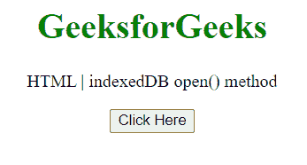
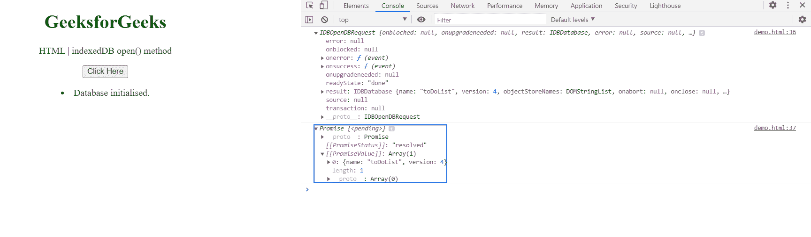

# HTML DOM indexedDB open()方法

> 原文:[https://www . geesforgeks . org/html-DOM-indexed db-open-method/](https://www.geeksforgeeks.org/html-dom-indexeddb-open-method/)

indexed db 接口的 **open()** 方法请求打开到数据库的连接。 该方法立即返回一个 IDBOpenDBRequest 对象，异步执行打开操作。

**语法:**

```html
var IDBOpenDBRequest = indexedDB.open(name);
// Or
var IDBOpenDBRequest = indexedDB.open(name, version);

```

**参数:**该方法接受两个参数，如上所述，如下所述:

*   **名称:**要打开的数据库的名称。
*   **版本(可选):**打开数据库时使用的版本。

**返回值:**这个方法返回一个 IDBOpenDBRequest 对象。

**示例:**在本例中，我们将使用此方法打开一个名为“toDoList”的数据库。

## 超文本标记语言

```html
<!DOCTYPE html>
<html>
<head>
    <title>indexedDB open() method</title>
</head>
<body style="text-align: center;">
    <h1 style="color: green;">
        GeeksforGeeks
    </h1>

    <p>
        HTML | indexedDB open() method
    </p>

    <button onclick="Geeks()">
        Click Here
    </button>
    <p id="a"></p>

    <script>
    var a = document.getElementById("a");
    function Geeks() {
        window.indexedDB = window.indexedDB || 
                           window.mozIndexedDB ||
                           window.webkitIndexedDB ||
                           window.msIndexedDB
        window.IDBTransaction = window.IDBTransaction || 
                                window.webkitIDBTransaction || 
                                window.msIDBTransaction;
        window.IDBKeyRange = window.IDBKeyRange || 
                             window.webkitIDBKeyRange ||
                             window.msIDBKeyRange
        var DBOpen = window.indexedDB.open("toDoList", 4);

        DBOpen.onerror = function (event) {
            a.innerHTML += "<li>Error loading database.</li>";
        };

        DBOpen.onsuccess = function (event) {
            a.innerHTML += "<li>Database initialised.</li>";
            console.log(DBOpen);
            console.log(window.indexedDB.databases());
        };
    }
    </script>
</body>
</html>
```

**输出:**

**按钮点击前:**



**按钮点击后:**在控制台中，可以看到 IDBOpenDBRequest 对象和数据库数组中的数据库“toDoList”



**支持的浏览器:**

*   谷歌 Chrome
*   边缘
*   火狐浏览器
*   旅行队
*   歌剧