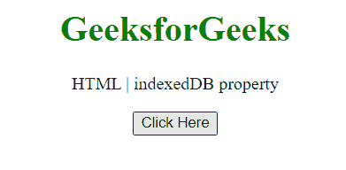
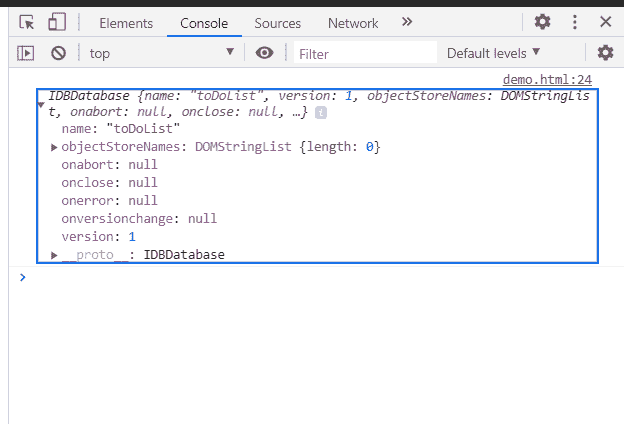

# HTML DOM indexedDB 属性

> 原文:[https://www.geeksforgeeks.org/html-dom-indexeddb-property/](https://www.geeksforgeeks.org/html-dom-indexeddb-property/)

**indexedDB** 属性为应用程序异步访问索引数据库的功能提供了一种机制。这是只读属性。

**语法:**

```html
var *IDBFactory* = window.indexedDB;
```

**返回值:**一个 IDBFactory 对象。

**示例:**以下示例创建了一个异步打开数据库的请求，在该请求中，当请求的 onsuccess 处理程序成功触发时，数据库将被打开。

```html
<!DOCTYPE HTML> 
<html>  
<head>
    <title>indexedDB property</title>
</head>   
<body style="text-align:center;">
    <h1 style="color:green;">  
        GeeksforGeeks  
    </h1> 
    <p> 
    HTML | indexedDB property
    </p>
    <button onclick = "Geeks()">
    Click Here
    </button>
    <p id="a"> 
    </p>       
    <script> 
        var a = document.getElementById("a");
        function Geeks() {
            var DB = 
               window.indexedDB.open('toDoList');
             DB.onsuccess = function(e) {
               indb = DB.result;
               console.log(indb);
           }
        } 
    </script> 
</body>   
</html>
```

**输出:**

**点击按钮前:**



**点击按钮后:**在控制台中，可以看到对象。



**支持的浏览器:**

*   谷歌 Chrome
*   边缘
*   火狐浏览器
*   旅行队
*   歌剧