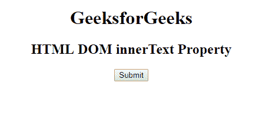
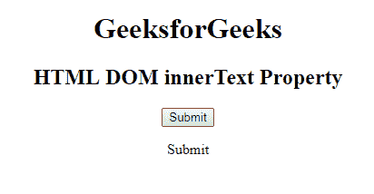
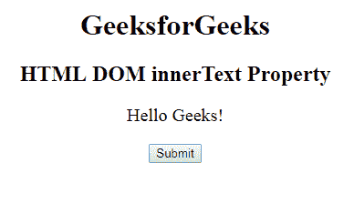

# HTML | DOM 内部文本属性

> 原文:[https://www.geeksforgeeks.org/html-dom-innertext-property/](https://www.geeksforgeeks.org/html-dom-innertext-property/)

**DOM innerText 属性**用于设置或返回指定节点及其后代的文本内容。此属性与文本内容属性非常相似，但返回所有元素的内容，除了<脚本>和<样式>元素。

**语法:**用于设置 innerText 属性。

```html
node.innerText = text 
```

**返回值:**返回一个字符串值，代表元素及其后代的文本内容。
**例-1:**

```html
<!DOCTYPE html>
<html>

<head>
    <title>
        HTML DOM innerText Property
    </title>
</head>

<body>
    <h1>GeeksforGeeks</h1>
    <h2>HTML DOM textContent Property</h2>

    <button id="geeks" onclick="MyGeeks()">
        Submit
    </button>

    <p id="sudo"></p>
    <script>
        function MyGeeks() {
            var text =
                document.getElementById("geeks").innerText;
            document.getElementById("sudo").innerHTML = text;
        }
    </script>
</body>

</html>         
```

**输出:**
点击按钮前:


点击按钮后:


**示例-2:**

```html
<!DOCTYPE html>
<html>

<head>
    <title>
        HTML DOM innerText Property
    </title>
</head>

<body>
    <center>
        <h1>GeeksforGeeks</h1>
        <h2>HTML DOM innerText Property</h2>
        <p id="geeks" style="font-size:20px;">Hello Geeks!</p>
        <button onclick="MyGeeks()">
            Submit
        </button>
        <!-- MyGeeks function replace the inner text-->
        <script>
            function MyGeeks() {
                document.getElementById("geeks").innerText =
                                  "Welcome to GeeksforGeeks!";
            }
        </script>
    </center>
</body>

</html>      
```

**输出:**
点击按钮前:
点击按钮后:


**支持的浏览器:**DOM innerText 属性支持的浏览器如下:

*   谷歌 Chrome 1.0
*   Internet Explorer 4.0
*   Firefox 1.0
*   歌剧 3.5
*   Safari 1.0