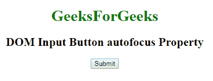

# HTML | DOM 输入按钮自动对焦属性

> 原文:[https://www . geesforgeks . org/html-DOM-input-button-autofocus-property/](https://www.geeksforgeeks.org/html-dom-input-button-autofocus-property/)

HTML DOM 中的 **DOM 输入按钮自动对焦属性**用于设置或返回页面加载时输入按钮字段是否应该自动对焦。该属性用于反映 **HTML 自动对焦属性。**

**语法:**

*   它返回自动对焦属性。

    ```html
    buttonObject.autofocus
    ```

*   它用于设置自动对焦属性。

    ```html
    buttonObject.autofocus = true|false
    ```

**属性值:**

*   真:它指定按钮字段获得焦点。
*   **false:** 指定按钮字段没有焦点。它有一个默认值。

**返回值:**返回一个布尔值，表示页面加载时按钮字段是否聚焦。

**示例-1:** 本示例说明如何**返回**自动对焦属性。

```html
<!DOCTYPE html> 
<html> 

<head> 
    <style> 
        h1 { 
            color: green; 
        } 
    </style> 
</head> 

<body style="text-align:center;"> 
    <h1>GeeksForGeeks</h1> 
    <h2> DOM Input Button autofocus Property </h2> 
        <form id="myGeeks">
    <!-- Assigning button id -->
    <input type="button" id="GFG" onclick="myGeeks()" 
    name="Geek_button" value="Submit" autofocus> 
                    </form>
    <p id="sudo" style="color:green;font-size:25px;"></p> 

    <script> 
        function myGeeks() { 

            // accessing 'button' id. 
            var g = document.getElementById("GFG").autofocus; 
            document.getElementById("sudo").innerHTML = g; 
        } 
    </script> 

</body> 

</html> 
```

**输出:**

**点击按钮前:**

**点击按钮后:**

**示例-2:** 本示例说明如何**设置**自动对焦属性。

```html
<!DOCTYPE html> 
<html> 

<head> 
    <style> 
        h1 { 
            color: green; 
        } 
    </style> 
</head> 

<body style="text-align:center;"> 
    <h1>GeeksForGeeks</h1> 
    <h2> DOM Input Button autofocus Property </h2> 
        <form id="myGeeks">
    <!-- Assigning button id -->
    <input type="button" id="GFG" onclick="myGeeks()" 
     name="Geek_button" value="Submit" autofocus> 
                    </form>
    <p id="sudo" style="color:green;font-size:25px;"></p> 

    <script> 
        function myGeeks() { 

            // accessing 'button' id. 
            var g = document.getElementById("GFG").autofocus = false; 
            document.getElementById("sudo").innerHTML = g; 
        } 
    </script> 

</body> 

</html> 
```

**输出:**
**点击按钮前:**

**点击按钮后:**


**支持的浏览器:**T2 DOM 输入按钮自动对焦属性支持的浏览器如下:

*   谷歌 Chrome
*   Internet Explorer 10.0 +
*   火狐浏览器
*   歌剧
*   旅行队