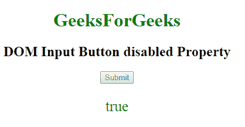

# HTML | DOM 输入按钮禁用属性

> 原文:[https://www . geesforgeks . org/html-DOM-input-button-disabled-property/](https://www.geeksforgeeks.org/html-dom-input-button-disabled-property/)

HTML DOM 中的 **DOM 输入按钮禁用属性**用于设置或返回输入按钮字段是否应禁用。
默认情况下，禁用的元素以灰色显示，不可用且不可点击。
**语法:**

*   它返回禁用的属性。

```html
buttonObject.disabled 
```

*   它用于设置禁用的属性。

```html
buttonObject.disabled = true|false 
```

**房产价值:**

*   **true:** 指定按钮字段被禁用。
*   **false:** 有默认值。它指定不禁用按钮字段。

**返回值:**返回布尔值，即如果按钮字段被禁用则为真，如果按钮字段未被禁用则为假。
**示例-1:** 本示例返回禁用属性的值。

## 超文本标记语言

```html
<!DOCTYPE html>
<html>

<head>
    <style>
        h1 {
            color: green;
        }
    </style>
</head>

<body style="text-align:center;">
    <h1>GeeksForGeeks</h1>
    <h2> DOM Input Button disabled Property </h2>
        <form id="myGeeks">

    <!-- Assigning button id -->
    <input type="button" id="GFG" onclick="myGeeks()"
      name="Geek_button" value="Submit" >
                    </form>
    <p id="sudo" style="color:green;font-size:25px;"></p>

    <script>
        function myGeeks() {

            // accessing 'button' id.
            var g = document.getElementById("GFG").disabled;
            document.getElementById("sudo").innerHTML = g;
        }
    </script>

</body>

</html>
```

**输出:**
**点击按钮前:**


**点击按钮后:**


**示例-2:** 本示例说明如何**设置**禁用属性。

## 超文本标记语言

```html
<!DOCTYPE html>
<html>

<head>
    <style>
        h1 {
            color: green;
        }
    </style>
</head>

<body style="text-align:center;">
    <h1>GeeksForGeeks</h1>
    <h2> DOM Input Button disabled Property </h2>
        <form id="myGeeks">
    <!-- Assigning button id -->
    <input type="button" id="GFG" onclick="myGeeks()"
       name="Geek_button" value="Submit" >
                    </form>
    <p id="sudo" style="color:green;font-size:25px;"></p>

    <script>
        function myGeeks() {

            // accessing 'button' id.
            var g = document.getElementById("GFG").disabled = "true";
            document.getElementById("sudo").innerHTML = g;
        }
    </script>

</body>

</html>
```

**输出:**
**点击按钮前:**


**点击按钮后:**



**支持的浏览器:**T2 DOM 输入按钮禁用属性支持的浏览器如下:

*   谷歌 Chrome
*   Internet Explorer 10.0 +
*   火狐浏览器
*   歌剧
*   旅行队