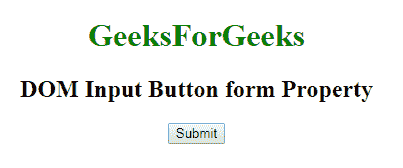
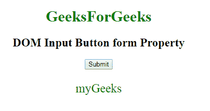

# HTML | DOM 输入按钮表单属性

> 原文:[https://www . geesforgeks . org/html-DOM-input-button-form-property/](https://www.geeksforgeeks.org/html-dom-input-button-form-property/)

HTML DOM 中的 **DOM 输入按钮表单属性**用于**返回** **，对包含输入按钮字段的表单的引用是**。它是只读属性，在成功时返回表单对象。
**语法:**

```html
buttonObject.form
```

**返回值:**它返回一个字符串值，该值指定包含输入按钮字段的表单的引用

**示例:**下面的程序说明了输入按钮表单属性的使用。

## 超文本标记语言

```html
<!DOCTYPE html>
<html>

<head>
    <style>
        h1 {
            color: green;
        }
    </style>
</head>

<body style="text-align:center;">
    <h1>GeeksForGeeks</h1>
    <h2>
      DOM Input Button form Property
  </h2>
    <form id="myGeeks">
        <!-- Assigning button id -->
        <input type="button"
               id="GFG"
               onclick="myGeeks()"
               name="Geek_button"
               value="Submit">
    </form>
    <p id="sudo"
       style="color:green;
              font-size:25px;">
  </p>

    <script>
        function myGeeks() {

            // accessing 'button' id.
            var g =
                document.getElementById(
                  "GFG").form.id;

            document.getElementById(
              "sudo").innerHTML = g;
        }
    </script>

</body>

</html>
```

**输出:**
**点击按钮前:**



**点击按钮后:**



**支持的浏览器:**T2 DOM 输入按钮表单属性支持的浏览器如下:

*   谷歌 Chrome
*   Internet Explorer 10.0 +
*   火狐浏览器
*   歌剧
*   旅行队