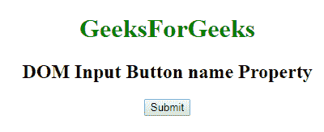
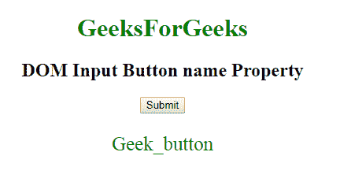
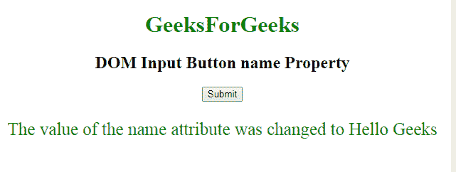

# HTML | DOM 输入按钮名称属性

> 原文:[https://www . geesforgeks . org/html-DOM-input-button-name-property/](https://www.geeksforgeeks.org/html-dom-input-button-name-property/)

HTML DOM 中的 **DOM 输入按钮名称属性**用于**设置**或**返回** *按钮字段*的名称属性值。每个输入字段都需要名称属性。如果没有在输入字段中指定 name 属性，则根本不会发送该字段的数据。

**语法:**

*   它返回输入按钮名称属性。

    ```html
    buttonObject.name
    ```

*   它用于设置输入按钮名称属性。

    ```html
    buttonObject.name = name
    ```

**属性值:**它包含一个定义按钮字段名称的值名。

**返回值:**返回代表按钮字段名称的字符串值。

**示例 1:** 本示例说明如何返回输入按钮名称属性。

```html
<!DOCTYPE html>
<html>

<head>
    <style>
        h1 {
            color: green;
        }
    </style>
</head>

<body style="text-align:center;">
    <h1>GeeksForGeeks</h1>
    <h2>
      DOM Input Button name Property
  </h2>

    <!-- Assigning button id -->
    <input type="button" 
           id="GFG" 
           onclick="myGeeks()" 
           name="Geek_button" 
           value="Submit">

    <p id="sudo" 
       style="color:green;
              font-size:25px;">
  </p>

    <script>
        function myGeeks() {

            // accessing 'button' id. 
            var g = 
                document.getElementById(
                  "GFG").name;

            document.getElementById(
              "sudo").innerHTML = g;
        }
    </script>

</body>

</html>
```

**输出:**
**点击按钮前:**


**点击按钮后:**


**示例-2:** 本示例说明如何**设置**属性。

```html
<!DOCTYPE html>
<html>

<head>
    <style>
        h1 {
            color: green;
        }
    </style>
</head>

<body style="text-align:center;">
    <h1>GeeksForGeeks</h1>
    <h2>
      DOM Input Button name Property
  </h2>

    <!-- Assigning button id -->
    <input type="button" 
           id="GFG" 
           onclick="myGeeks()"
           name="Geek_button" 
           value="Submit">

    <p id="sudo" 
       style="color:green;
              font-size:25px;">
  </p>

    <script>
        function myGeeks() {

            // accessing 'button' id. 
            var g = 
                document.getElementById(
                  "GFG").name = "Hello Geeks";

            document.getElementById(
              "sudo").innerHTML = 
              "The value of the name attribute"+
              " was changed to " + g;
        }
    </script>

</body>

</html>
```

**输出:**
**点击按钮前:**


**点击按钮后:**


**支持的浏览器:****DOM 输入按钮名称属性**支持的浏览器如下:

*   谷歌 Chrome
*   Internet Explorer 10.0 +
*   火狐浏览器
*   歌剧
*   旅行队