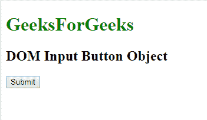
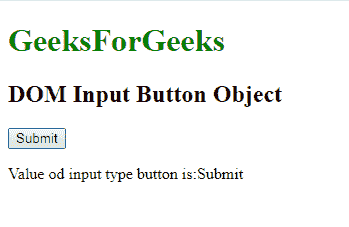
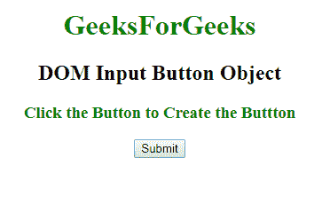
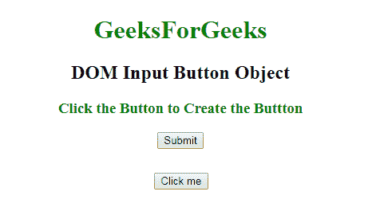

# HTML | DOM 输入按钮对象

> 原文:[https://www.geeksforgeeks.org/html-dom-input-button-object/](https://www.geeksforgeeks.org/html-dom-input-button-object/)

**DOM 输入类型按钮对象**用于用 *type="button"* 表示 *HTML <输入>* 元素。输入类型按钮元素由 **getElementById()** 访问。

**语法:**

```html
document.getElementById("ID");
```

其中**“id”**是分配给**“输入”**标签的 ID。
**例-1:**

## 超文本标记语言

```html
<!DOCTYPE html>
<html>

<head>
    <style>
        h1 {
            color: green;
        }
    </style>
</head>

<body>
    <h1>GeeksForGeeks</h1>
    <h2> DOM Input Button Object </h2>

    <!-- Assigning button id -->
    <input type="button" id="GFG" onclick="myGeeks()" value="Submit">

    <p id="sudo"></p>

    <script>
        function myGeeks() {

            // accessing 'button' id.
            var g = document.getElementById("GFG").value;
            document.getElementById("sudo").innerHTML =
              "Value od input type button is:" + g;
        }
    </script>

</body>

</html>
```

**输出:**
**点击按钮前:**



**点击按钮后:**



**示例-2:** 输入按钮对象可以使用**文档.创建元素**方法创建。

## 超文本标记语言

```html
<!DOCTYPE html>
<html>

<head>
    <style>
        h1 {
            color: green;
        }

        #GFG {
            margin-left: 45%;
            margin-top: 30px;
        }
    </style>
</head>

<body>
    <h1>GeeksForGeeks</h1>
    <h2> DOM Input Button Object </h2>
    <h3 style="color:green;">
      Click the Button to Create the Button</h3>

    <button onclick="myGeeks()">Submit</button>
    <script>
        function myGeeks() {
            var g = document.createElement("INPUT");
            g.setAttribute("type", "button");
            g.setAttribute("value", "Click me");
            g.setAttribute("id", "GFG");
            document.body.appendChild(g);
        }
    </script>

</body>

</html>
```

**输出:**
**点击按钮前:**



**点击按钮后:**



**支持的浏览器:****DOM 输入按钮对象**支持的浏览器如下:

*   谷歌 Chrome
*   微软公司出品的 web 浏览器
*   火狐浏览器
*   歌剧
*   旅行队