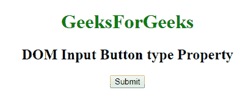

# HTML | DOM 输入按钮类型属性

> 原文:[https://www . geesforgeks . org/html-DOM-input-button-type-property/](https://www.geeksforgeeks.org/html-dom-input-button-type-property/)

HTML DOM 中的 **DOM 输入按钮类型属性**用于**返回** *包含输入按钮字段的表单元素类型为*。该属性将始终返回**“按钮”**。
**语法:**

```html
buttonObject.type
```

**返回值:**返回一个字符串值，代表输入按钮字段的形式元素类型。

**下面的程序说明了输入按钮类型属性的使用。**
**例-1:**

## 超文本标记语言

```html
<!DOCTYPE html>
<html>

<head>
    <style>
        h1 {
            color: green;
        }
    </style>
</head>

<body style="text-align:center;">
    <h1>GeeksForGeeks</h1>
    <h2>
      DOM Input Button type Property
  </h2>

    <!-- Assigning button id -->
    <input type="button"
           id="GFG"
           onclick="myGeeks()"
           value="Submit">

    <p id="sudo"
       style="color:green;
              font-size:25px;">
  </p>

    <script>
        function myGeeks() {

            // accessing 'button' id.
            var g =
                document.getElementById(
                  "GFG").type;

            document.getElementById(
              "sudo").innerHTML = g;
        }
    </script>

</body>

</html>
```

**输出:**
**点击按钮前:**



**点击按钮后:**


**支持的浏览器:**以下所列 **DOM 输入按钮类型属性**支持的浏览器:

*   谷歌 Chrome
*   Internet Explorer 10.0 +
*   火狐浏览器
*   歌剧
*   旅行队