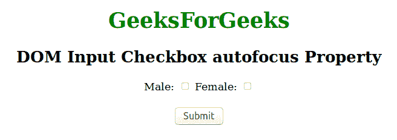
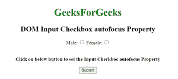
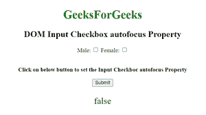

# HTML | DOM 输入复选框自动对焦属性

> 原文:[https://www . geesforgeks . org/html-DOM-input-checkbox-autofocus-property/](https://www.geeksforgeeks.org/html-dom-input-checkbox-autofocus-property/)

**DOM 输入复选框属性**用于设置或返回页面加载时元素是否应该获得焦点。此属性用于反映 HTML 自动对焦属性。
**语法:**

*   它用于返回自动对焦属性。

```html
checkboxObject.autofocus
```

*   它用于设置自动对焦属性。

```html
checkboxObject.autofocus = true|false
```

**房产价值:**

*   **true:** 定义复选框获得焦点。
*   **false:** 有默认值。它定义复选框不能获得焦点。

**返回值:**返回一个布尔值，表示**复选框是否自动对焦。**
下面的程序说明了如何返回自动对焦属性。

## 超文本标记语言

```html
<!DOCTYPE html>
<html>

<body>
    <center>
        <h1 style="color:green;">GeeksForGeeks</h1>
        <h2> DOM Input Checkbox autofocus Property</h2>
        Male:
        <input type="checkbox" id="myGeeks" autofocus>
        Female:
        <input type="checkbox" id="GFG">
        <br>
        <br>

        <button onclick="myGeeks()">Submit</button>

        <p id="sudo" style="color:green;font-size:25px;"></p>

        <script>
            function myGeeks() {
                var x = document.getElementById("myGeeks").autofocus;
                document.getElementById("sudo").innerHTML = x;
            }
        </script>

</body>

</html>
```

**输出:**
**点击按钮前:**



**点击按钮后:**


**示例-2: B** 下面的 HTML 代码说明了如何设置复选框自动对焦属性。

## 超文本标记语言

```html
                        <!DOCTYPE html>
<html>

<body>
    <center>
        <h1 style="color:green;">GeeksForGeeks</h1>
        <h2> DOM Input Checkbox autofocus Property</h2>
        Male:
        <input type="checkbox" id="myGeeks" autofocus>
        Female:
        <input type="checkbox" id="GFG">
        <br>
        <br>

<p><b>
        Click on below button to set the Input Checkboc autofocus Property </p>
</b>

        <button onclick="myGeeks()">Submit</button>

        <p id="sudo" style="color:green;font-size:25px;"></p>

        <script>
            function myGeeks() {
                var x = document.getElementById("myGeeks").autofocus = "false";
                document.getElementById("sudo").innerHTML = x;
            }
        </script>

</body>

</html>
```

**输出**

**点击按钮前:**



**点击按钮后:**



**支持的浏览器:**T2 DOM 输入复选框自动对焦属性支持的浏览器如下:

*   谷歌 Chrome
*   微软公司出品的 web 浏览器
*   火狐浏览器
*   歌剧
*   旅行队