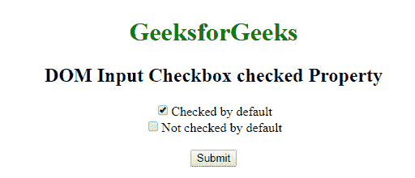
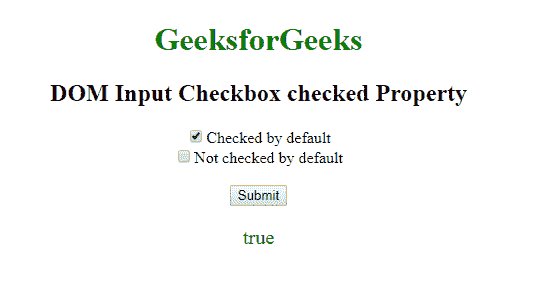
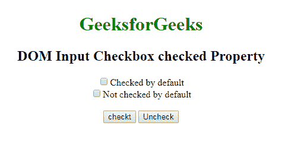
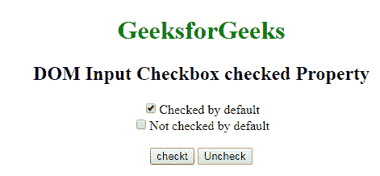

# HTML | DOM 输入复选框选中属性

> 原文:[https://www . geesforgeks . org/html-DOM-input-checkbox-checkbox-property/](https://www.geeksforgeeks.org/html-dom-input-checkbox-checked-property/)

**DOM 输入复选框属性**用于设置或返回复选框字段的选中状态。该属性用于反映 **HTML 选中属性。**

**语法:**

*   它用于返回选中的属性。

    ```html
    checkboxObject.checked
    ```

*   它用于设置选中的属性。

    ```html
    checkboxObject.checked = true|false
    ```

**属性值:**

*   **真:**定义复选框处于选中状态。
*   **假:**表示不勾选复选框。默认为假。

**返回值:**返回一个布尔值，表示复选框是否被选中。

**示例:**此示例说明如何返回复选框选中属性。

```html
<!DOCTYPE html> 
<html> 
    <head> 
        <title>DOM Input Checkbox Checked Property</title>
    </head> 
    <body style = "text-align: center;"> 
        <h1 style = "color: green;">GeeksforGeeks</h1> 
        <h2>DOM Input Checkbox checked Property</h2> 
        <form > 
            <!-- Below input elements have attribute "checked" -->
            <input type="checkbox" name="check" id="GFG" 
                  value="1" checked>Checked by default<br> 

            <input type="checkbox" name="check" value="2">
                                Not checked by default<br> 
        </form> <br>
<button onclick="myGeeks()">Submit</button>
  <p id="sudo" style="color:green;font-size:20px;"></p>
        <script>
function myGeeks() {
  var g = document.getElementById("GFG").checked;
  document.getElementById("sudo").innerHTML = g;
}
</script>
    </body> 
</html>                     

```

**输出:**
**点击按钮前:**


**点击按钮后:**


**示例-2:** 该示例说明了如何选中和取消选中复选框。

```html
<!DOCTYPE html> 
<html> 
    <head> 
        <title>DOM Input Checkbox Checked Property</title>
    </head> 
    <body style = "text-align: center;"> 
        <h1 style = "color: green;">GeeksforGeeks</h1> 
        <h2>DOM Input Checkbox  checked Property</h2> 
        <form > 
            <!-- Below input elements have attribute "checked" -->
            <input type="checkbox" name="check" id="GFG" 
                           value="1">Checked by default<br> 

            <input type="checkbox" name="check" value="2">
                                 Not checked by default<br> 
        </form> <br>
     <button onclick="myGeeks()">checkt</button>
     <button onclick="Geeks()">Uncheck</button>

      <script>
        function myGeeks() {
           var g = document.getElementById("GFG").checked = true;
             }
        function Geeks() {
           var w = document.getElementById("GFG").checked = false;
         }

</script>
    </body> 
</html>                     

```

**输出:**

**点击按钮前:**


点击检查按钮后:


**点击取消勾选按钮后:**


**支持的浏览器:**支持的浏览器 **DOM 输入复选框勾选属性**如下:

*   谷歌 Chrome
*   微软公司出品的 web 浏览器
*   火狐浏览器
*   歌剧
*   旅行队