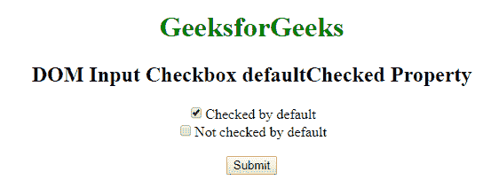
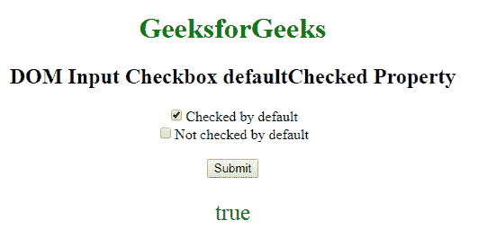

# HTML | DOM 输入复选框默认选中属性

> 原文:[https://www . geesforgeks . org/html-DOM-input-checkbox-default checked-property/](https://www.geeksforgeeks.org/html-dom-input-checkbox-defaultchecked-property/)

HTML 中的**输入复选框默认选中属性**用于返回选中属性的默认值。它有一个布尔值，如果默认选中复选框，则返回 true，否则返回 false。

**语法:**

```html
checkboxObject.defaultChecked

```

**返回值:**它返回一个布尔值，如果默认情况下复选框被选中，则该值返回真，否则返回假。

**示例:**此示例说明了输入复选框默认选中属性。

## 超文本标记语言

```html
<!DOCTYPE html> 
<html> 
    <head> 
        <title>
            DOM Input Checkbox defaultChecked Property
        </title> 
    </head> 

    <body style="text-align:center;"> 

        <h1 style="color:green;">
            GeeksforGeeks
        </h1> 

        <h2>DOM Input Checkbox defaultChecked Property</h2> 

        <form id="myGeeks"> 

            <!-- Below input elements have attribute
                 checked -->
            <input type="checkbox" name="check" id="GFG"
                    value="1" Checked>Checked by default<br> 

            <input type="checkbox" name="check" value="2">
                    Not checked by default<br> 
        </form><br>

        <button onclick="myGeeks()">
            Submit
        </button>

        <p id="sudo" style="color:green;font-size:25px;"></p>

        <!-- Script to return the Input Checkbox 
            defaultChecked Property -->
        <script>
            function myGeeks() {
                var g = document.getElementById("GFG").defaultChecked;
                document.getElementById("sudo").innerHTML = g;
            }
        </script>
    </body> 
</html>                             
```

**输出:**
**点击按钮前:**



**点击按钮后:**



**支持的浏览器:**由 **DOM 输入复选框默认选中属性**支持的浏览器如下:

*   谷歌 Chrome
*   微软公司出品的 web 浏览器
*   火狐浏览器
*   歌剧
*   旅行队