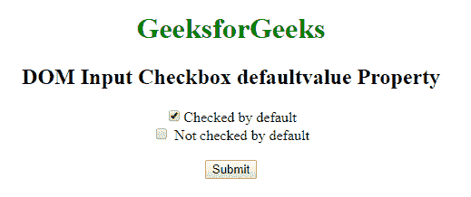
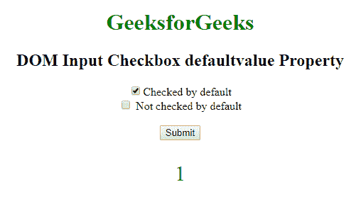
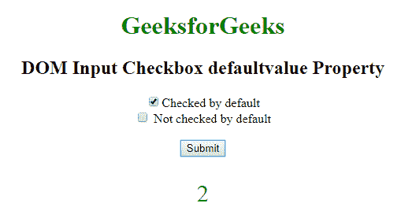

# HTML | DOM 输入复选框默认值属性

> 原文:[https://www . geeksforgeeks . org/html-DOM-input-checkbox-default value-propertret/](https://www.geeksforgeeks.org/html-dom-input-checkbox-defaultvalue-propert/)

**DOM 输入复选框默认值属性**用于设置或返回输入复选框字段的默认值。此属性用于反映 HTML 值属性。默认值与值的主要区别在于，默认值表示默认值，值包含进行一些更改后的当前值。此属性对于确定日期字段是否已更改非常有用。

**语法:**

*   它返回 defaultValue 属性。

    ```html
    checkboxObject.defaultValue
    ```

*   它用于设置 defaultValue 属性。

    ```html
    checkboxObject.defaultValue = value
    ```

**属性值:**包含单个属性值**值**，定义输入复选框字段的默认值。

**返回值:**返回一个代表输入复选框字段默认值的字符串值。

**示例 1:** 本示例说明如何返回输入复选框默认值属性。

```html
<!DOCTYPE html> 
<html> 
    <head> 
        <title> 
            DOM Input Checkbox defaultvalue Property 
        </title> 
    </head> 

    <body style = "text-align: center;"> 

        <h1 style = "color:green;"> 
            GeeksforGeeks 
        </h1> 

        <h2>DOM Input Checkbox defaultvalue Property</h2> 

        <form > 

            <!-- Below input elements have attribute 
                checked -->
            <input type="checkbox" name="check" id="GFG"
                    value="1" checked>Checked by default<br> 
            <input type="checkbox" name="check" value="2"> 
                    Not checked by default<br> 
        </form> <br> 

        <button onclick="myGeeks()"> 
            Submit 
        </button> 

        <p id="sudo" style="color:green;font-size:30px;"></p> 

        <!-- script to return Input Checkbox value Property -->
        <script> 
            function myGeeks() { 
                var g = document.getElementById("GFG").defaultValue; 
                document.getElementById("sudo").innerHTML = g; 
            } 
        </script> 
    </body> 
</html>                     
```

**Output:**

*   **点击按钮前:**
    *   **After Clicking On Button:**
    

    **示例 2:** 本示例说明如何设置输入复选框默认值属性。

    ```html
    <!DOCTYPE html> 
    <html> 
        <head> 
            <title> 
                DOM Input Checkbox defaultvalue Property 
            </title> 
        </head> 

        <body style = "text-align: center;"> 

            <h1 style = "color:green;"> 
                GeeksforGeeks 
            </h1> 

            <h2>DOM Input Checkbox defaultvalue Property</h2> 

            <form > 

                <!-- Below input elements have attribute 
                    checked -->
                <input type="checkbox" name="check" id="GFG"
                        value="1" checked>Checked by default<br> 
                <input type="checkbox" name="check" value="2"> 
                        Not checked by default<br> 
            </form> <br> 

            <button onclick="myGeeks()"> 
                Submit 
            </button> 

            <p id="sudo" style="color:green;font-size:30px;"></p> 

            <!-- script to return Input Checkbox value Property -->
            <script> 
                function myGeeks() { 
                    var g = document.getElementById("GFG").defaultValue = "2"; 
                    document.getElementById("sudo").innerHTML = g; 
                } 
            </script> 
        </body> 
    </html>
    ```

    **输出:**

    *   **点击按钮前:**
        
    *   **点击按钮后:**
        

    **支持的浏览器:**下面列出了 **DOM 输入复选框默认值属性**支持的浏览器:

    *   谷歌 Chrome
    *   微软公司出品的 web 浏览器
    *   火狐浏览器
    *   苹果 Safari
    *   歌剧