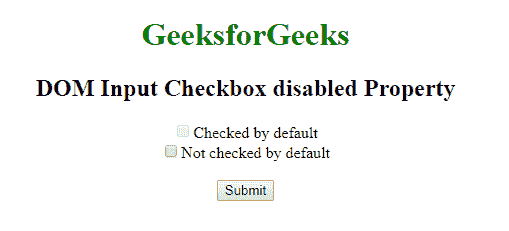
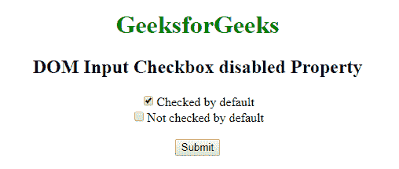
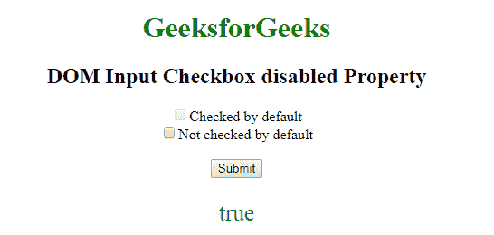

# HTML | DOM 输入复选框禁用属性

> 原文:[https://www . geesforgeks . org/html-DOM-input-checkbox-disabled-property/](https://www.geeksforgeeks.org/html-dom-input-checkbox-disabled-property/)

HTML DOM 中的**输入复选框禁用属性**用于设置或返回是否必须禁用输入复选框字段。禁用的复选框不可勾选且不可用。它是一个布尔属性，用于反映 HTML 禁用属性。

**语法:**

*   它返回“输入复选框已禁用”属性。

    ```html
    checkboxObject.disabled
    ```

*   It is used to set the Input Checkbox disabled property.

    ```html
    checkboxObject.disabled = true|false
    ```

    **属性值:**包含以下两个属性值:

    *   **真:**定义复选框被禁用。
    *   **False:** 有默认值。它定义复选框未被禁用。

    **返回值:**返回一个布尔值，代表复选框是否被禁用。

    **示例 1:** 本示例设置输入复选框禁用属性。

    ```html
    <!DOCTYPE html> 
    <html> 
        <head> 
            <title>
                DOM Input Checkbox disabled Property
            </title> 
        </head> 

        <body style="text-align:center;"> 

            <h1 style="color:green;">
                GeeksforGeeks
            </h1> 

            <h2>DOM Input Checkbox disabled Property</h2>

            <form id="myGeeks"> 

                <!-- Below input elements have attribute
                    checked -->
                <input type="checkbox" name="check" id="GFG"
                        value="1" disabled>Checked by default<br>

                <input type="checkbox" name="check" value="2">
                        Not checked by default<br> 
            </form><br>

            <button onclick="myGeeks()">
                Submit
            </button>

            <!-- Script to disable checkbox -->
            <script>
                function myGeeks() {
                    var g = document.getElementById("GFG").disabled
                            = false;
                }
            </script>
        </body> 
    </html>                                
    ```

    **输出:**
    **点击按钮前:**
    
    **点击按钮后:**
    

    **示例 2:** 本示例返回输入复选框禁用属性。

    ```html
    <!DOCTYPE html> 
    <html> 
        <head> 
            <title>
                DOM Input Checkbox disabled Property
            </title> 
        </head> 

        <body style="text-align:center;"> 

            <h1 style="color:green;">
                GeeksforGeeks
            </h1> 

            <h2>DOM Input Checkbox disabled Property</h2> 

            <form id="myGeeks">

                <!-- Below input elements have attribute
                    checked -->
                <input type="checkbox" name="check" id="GFG" 
                        value="1" disabled>Checked by default<br> 

                <input type="checkbox" name="check" value="2">
                        Not checked by default<br> 
            </form><br>

            <button onclick="myGeeks()">
                Submit
            </button>

            <p id="sudo" style="color:green;font-size:25px;"></p>

            <!-- Script to return Input Checkbox disabled Property -->
            <script>
                function myGeeks() {
                    var g = document.getElementById("GFG").disabled;
                    document.getElementById("sudo").innerHTML = g;
                }
            </script>
        </body> 
    </html>                              
    ```

    **输出:**
    **点击按钮前:**
    
    **点击按钮后:**
    

    **支持的浏览器:**以下列出了 **DOM 输入复选框禁用属性**支持的浏览器:

    *   谷歌 Chrome
    *   微软公司出品的 web 浏览器
    *   火狐浏览器
    *   歌剧
    *   旅行队