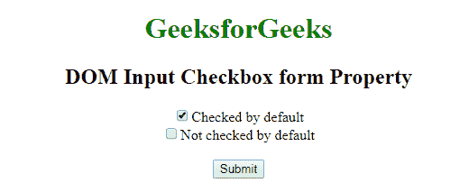
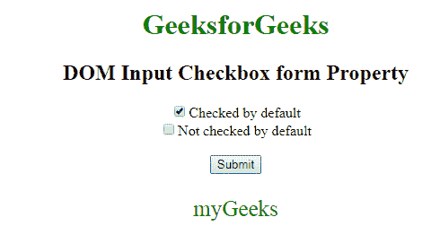

# HTML | DOM 输入复选框表单属性

> 原文:[https://www . geesforgeks . org/html-DOM-input-checkbox-form-property/](https://www.geeksforgeeks.org/html-dom-input-checkbox-form-property/)

HTML DOM 中的**输入复选框表单属性**用于返回包含输入复选框字段的表单的引用。成功时返回表单对象的是只读属性。
**语法:**

```html
checkboxObject.form
```

**返回值:**它返回一个字符串值，该值指定包含输入复选框字段的表单的引用。

**示例:**此示例说明了输入复选框表单属性。

## 超文本标记语言

```html
<!DOCTYPE html>
<html>
    <head>
        <title>
            DOM Input Checkbox form Property
        </title>
    </head>

    <body style = "text-align: center;">

        <h1 style = "color: green;">
            GeeksforGeeks
        </h1>

        <h2>DOM Input Checkbox form Property</h2>

        <form id="myGeeks">

            <!-- Below input elements have attribute
                checked -->
            <input type="checkbox" name="check" id="GFG"
                    value="1" checked>Checked by default<br>

            <input type="checkbox" name="check" value="2">
                    Not checked by default<br>
        </form><br>

        <button onclick="myGeeks()">
            Submit
        </button>

        <p id="sudo" style="color:green;font-size:25px;"></p>

        <!-- Script to use Input Checkbox form Property -->
        <script>
            function myGeeks() {
                var g = document.getElementById("GFG").form.id;
                document.getElementById("sudo").innerHTML = g;
            }
        </script>
    </body>
</html>                              
```

**输出:**
**点击按钮前:**



**点击按钮后:**



**支持的浏览器:**T2 DOM 输入复选框表单属性支持的浏览器如下:

*   谷歌 Chrome
*   微软公司出品的 web 浏览器
*   火狐浏览器
*   歌剧
*   旅行队