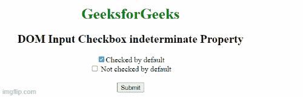

# HTML DOM 输入复选框不确定属性

> 原文:[https://www . geeksforgeeks . org/html-DOM-input-checkbox-不定-property/](https://www.geeksforgeeks.org/html-dom-input-checkbox-indeterminate-property/)

HTML DOM 中的 i **nput 复选框不确定属性**用于设置或返回复选框的状态是否已更改。

基本上，复选框有三种状态–

*   **真:**表示复选框状态为开。
*   **假:**表示复选框状态为未选中或关闭。
*   **不确定:**表示复选框既不是**开**也不是**关。**

**不确定复选框:**不确定是复选框的第三种状态，介于选中和未选中的不确定状态之间，可以借助 JavaScript 进行设置。此状态可用于强制用户选中或取消选中复选框。

**语法**

*   它返回不确定属性:

    ```html
    checkboxObject.indeterminate
    ```

*   它设置了不确定属性:

    ```html
    checkboxObject.indeterminate = true|false
    ```

**返回值:**如果复选框处于不确定状态，则返回布尔值，否则返回 false

**属性值:**它包含一个**布尔**值，指示复选框是否具有不确定状态。

*   **真:**定义复选框设置为不确定状态。
*   **false:** 定义复选框不处于不确定状态。

**示例:**下面的 HTML 代码说明了如何返回不确定属性。

## 超文本标记语言

```html
<!DOCTYPE html>
<html>

<head>
    <title>
        DOM Input Checkbox indeterminate Property
    </title>
</head>

<body style="text-align: center;">

    <h1 style="color:green;">
        GeeksforGeeks
    </h1>

    <h2>DOM Input Checkbox indeterminate Property</h2>

    <form>

        <!-- Below input elements have 
             attribute checked -->
        <input type="checkbox" name="check" 
            id="GFG" value="1" checked>
        Checked by default<br>

        <input type="checkbox" name="check" value="2">
        Not checked by default<br>
    </form> <br>

    <button onclick="myGeeks()">
        Submit
    </button>

    <p id="sudo" style="color:green;font-size:30px;"></p>

    <!-- script to return Input Checkbox 
        indeterminate Property -->
    <script>
        function myGeeks() {
            var g = document.getElementById("GFG").indeterminate;
            document.getElementById("sudo").innerHTML = g;
        }
    </script>
</body>

</html>
```

**输出:**



**支持的浏览器:**

*   谷歌 Chrome
*   微软公司出品的 web 浏览器
*   歌剧
*   苹果 Safari
*   Mozilla Firefox