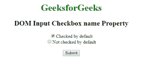
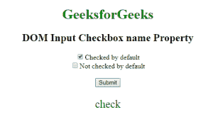
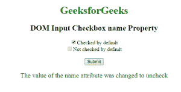

# HTML | DOM 输入复选框名称属性

> 原文:[https://www . geesforgeks . org/html-DOM-input-checkbox-name-property/](https://www.geeksforgeeks.org/html-dom-input-checkbox-name-property/)

HTML DOM 中的**输入复选框名称属性**用于设置或返回输入复选框字段的名称属性值。每个输入字段都需要名称属性。如果没有在输入字段中指定 name 属性，则根本不会发送该字段的数据。

**语法:**

*   它返回输入复选框名称属性。

    ```html
    checkboxObject.name
    ```

*   It is used to set the Input Checkbox name property.

    ```html
    checkboxObject.name = name
    ```

    **属性值:**包含单个属性值**名称**，用于指定复选框的名称。

    **返回值:**返回代表输入复选框字段名称的字符串值。

    **示例 1:** 本示例返回输入复选框名称属性。

    ```html
    <!DOCTYPE html> 
    <html> 
        <head> 
            <title>
                DOM Input Checkbox name Property
            </title> 
        </head>

        <body style = "text-align: center;"> 

            <h1 style = "color:green;">
                GeeksforGeeks
            </h1> 

            <h2>DOM Input Checkbox name Property</h2>

            <form > 

                <!-- Below input elements have attribute "checked" -->
                <input type="checkbox" name="check" id="GFG"
                        value="1" checked>Checked by default<br> 

                <input type="checkbox" name="check" value="2">
                        Not checked by default<br> 
            </form> <br>

            <button onclick="myGeeks()">
                Submit
            </button>

            <p id="sudo" style="color:green;font-size:25px;"></p>

            <!-- Script to set Input Checkbox name Property -->
            <script>
                function myGeeks() {
                    var g = document.getElementById("GFG").name
                    document.getElementById("sudo").innerHTML = g;
                }
            </script>
        </body> 
    </html>                               
    ```

    **输出:**
    **点击按钮前:**
    
    **点击按钮后:**
    

    **示例 2:** 本示例设置输入复选框名称属性。

    ```html
    <!DOCTYPE html> 
    <html> 
        <head> 
            <title>
                DOM Input Checkbox name Property
            </title> 
        </head> 

        <body style = "text-align: center;"> 

            <h1 style = "color: green;">
                GeeksforGeeks
            </h1> 

            <h2>DOM Input Checkbox name Property</h2> 

            <form > 

                <!-- Below input elements have attribute
                    "checked" -->
                <input type="checkbox" name="check" id="GFG"
                        value="1" checked>Checked by default<br> 

                <input type="checkbox" name="check" value="2">
                        Not checked by default<br> 
            </form> <br>

            <button onclick="myGeeks()">
                Submit
            </button>

            <p id="sudo" style="color:green;font-size:20px;"></p>

            <!-- Script to set Input Checkbox name property -->
            <script>
                function myGeeks() {
                    var g = document.getElementById("GFG").name
                            = "uncheck";
                    document.getElementById("sudo").innerHTML
                            = "The value of the name attribute"
                              + " was changed to " + g;
                }
            </script>
        </body> 
    </html>                     
    ```

    **输出:**
    **点击按钮前:**
    
    **点击按钮后:**
    

    **支持的浏览器:****DOM 输入复选框名称属性**支持的浏览器如下:

    *   谷歌 Chrome
    *   微软公司出品的 web 浏览器
    *   火狐浏览器
    *   歌剧
    *   旅行队