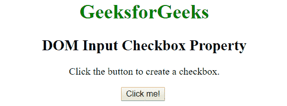
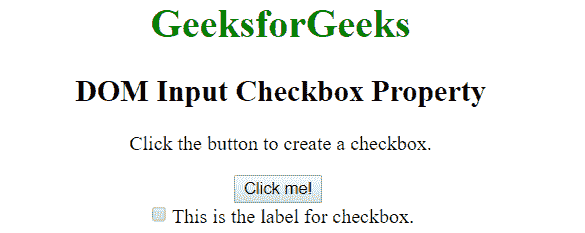
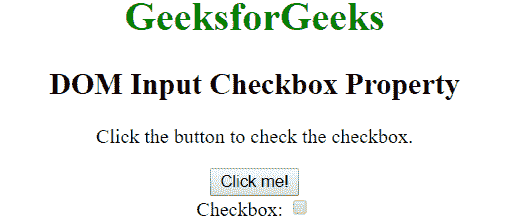
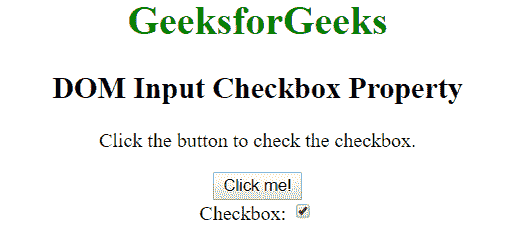

# HTML | DOM 输入复选框属性

> 原文:[https://www . geesforgeks . org/html-DOM-input-checkbox-property/](https://www.geeksforgeeks.org/html-dom-input-checkbox-property/)

HTML 中的输入复选框对象代表 HTML 表单中的一个复选框。
对于 HTML 表单中的 **<输入元素的每个实例，都会创建一个复选框对象。要访问 checkbox 对象，请使用索引相应表单的元素数组或使用 getElementById()；
**创建复选框对象**:我们可以通过 javascript 创建复选框对象。要创建<输入类型=“复选框”>元素，请使用 document.createElement()方法。创建后，使用 appendChild()方法将其追加到特定元素(如 div)中以显示它。
**例:**** 

## 超文本标记语言

```html
<!DOCTYPE html>
<html>
    <head>
        <title>
            DOM Input Checkbox Property
        </title>
    </head>
    <body style = "text-align: center;">
        <h1 style = "color:green;">
            GeeksforGeeks
        </h1>
        <h2>
            DOM Input Checkbox Property
        </h2>

<p>Click the button to create a checkbox.</p>

        <button onclick="geek()">Click me!</button>
        <br>
        <div id = "myDiv"></div>
        <script>
        function geek() {
            var myDiv = document.getElementById("myDiv");

            // creating checkbox element
            var checkbox = document.createElement('input');

            // Assigning the attributes
            // to created checkbox
            checkbox.type = "checkbox";
            checkbox.name = "name";
            checkbox.value = "value";
            checkbox.id = "id";

            // creating label for checkbox
            var label = document.createElement('label');

            // assigning attributes for
            // the created label tag
            label.htmlFor = "id";

            // appending the created text to
            // the created label tag
            label.appendChild(document.createTextNode('This is the label for checkbox.'));

            // appending the checkbox
            // and label to div
            myDiv.appendChild(checkbox);
            myDiv.appendChild(label);
        }
        </script>
    </body>
</html>
```

**输出:**
**点击按钮前:**



**点击按钮后:**



**访问复选框对象:**我们可以使用 getElementById()方法访问复选框对象。将复选框元素的 id 放在 getElementById()中进行访问。
**例:**

## 超文本标记语言

```html
<!DOCTYPE html>
<html>
    <head>
        <title>
            DOM Input Checkbox Property
        </title>
    </head>
    <body style = "text-align: center;">
        <h1 style = "color:green;">
            GeeksforGeeks
        </h1>
        <h2>
            DOM Input Checkbox Property
        </h2>

<p>Click the button to check the checkbox.</p>

        <button onclick="myFunction()">Click me!</button>
        <br>
        Checkbox: <input type="checkbox" id="check">
        <script>
            function myFunction() {

              // fetching the checkbox by id
              var doc = document.getElementById("check");

              // changing the state of checkbox to checked
              doc.checked = true;
            }
        </script>
    </body>
</html>
```

**输出:**
**点击按钮前:**



**点击按钮后:**



**支持的浏览器**:DOM Input Checkbox 属性支持的浏览器如下:

*   谷歌 Chrome
*   微软公司出品的 web 浏览器
*   火狐浏览器
*   歌剧
*   旅行队