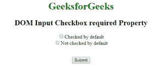
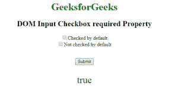
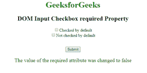

# HTML | DOM 输入复选框必填属性

> 原文:[https://www . geesforgeks . org/html-DOM-input-checkbox-required-property/](https://www.geeksforgeeks.org/html-dom-input-checkbox-required-property/)

HTML DOM 中的**输入复选框必填属性**用于在提交表单前设置或返回输入复选框字段是否应该勾选。此属性用于反映 HTML 必需的属性。

**语法:**

*   它返回输入复选框必需的属性。

    ```html
    checkboxObject.required
    ```

*   It is used to set the Input Checkbox required property.

    ```html
    checkboxObject.required = true|false
    ```

    **属性值:**包含以下两个属性值:

    *   **true:** 用于指定提交表单前必须勾选的复选框。
    *   **false:** 有默认值。它指定在提交表单之前不得选中复选框。

    **返回值:**返回一个布尔值，表示在提交表单之前是否必须勾选复选框。

    **示例 1:** 本示例返回输入复选框必需属性。

    ```html
    <!DOCTYPE html>
    <html> 
        <head> 
            <title>
                DOM Input Checkbox required Property
            </title>
        </head> 

        <body style = "text-align: center;"> 

            <h1 style = "color: green;">
                GeeksforGeeks
            </h1> 

            <h2>DOM Input Checkbox required Property</h2> 

            <form > 

                <!-- Below input elements have attribute "required" -->
                <input type="checkbox" name="check" id="GFG"
                        value="1" required>Checked by default<br> 

                <input type="checkbox" name="check" value="2">
                        Not checked by default<br> 
            </form> <br>

            <button onclick="myGeeks()">
                Submit
            </button>

            <p id="sudo" style="color:green;font-size:30px;"></p>

            <!-- Script to use required property -->
            <script>
                function myGeeks() {
                    var g = document.getElementById("GFG").required;
                    document.getElementById("sudo").innerHTML = g;
                }
            </script>
        </body> 
    </html>                    
    ```

    **输出:**
    **点击按钮前:**
    
    **点击按钮后:**
    

    **示例 2:** 本示例设置输入复选框必需属性。

    ```html
    <!DOCTYPE html>
    <html> 
        <head> 
            <title>
                DOM Input Checkbox required Property
            </title>
        </head> 

        <body style = "text-align: center;"> 

            <h1 style = "color: green;">
                GeeksforGeeks
            </h1> 

            <h2>DOM Input Checkbox required Property</h2>

            <form > 
                <!-- Below input elements have attribute
                        "required" -->
                <input type="checkbox" name="check" id="GFG"
                        value="1" required>Checked by default<br> 

                <input type="checkbox" name="check" value="2">
                        Not checked by default<br> 
            </form> <br>

            <button onclick="myGeeks()">
                Submit
            </button>

            <p id="sudo" style="color:green;font-size:20px;"></p>

            <!-- Script to set Input Checkbox required Property -->
            <script>
                function myGeeks() {
                    var g = document.getElementById("GFG").required
                            = "false";

                    document.getElementById("sudo").innerHTML
                            = "The value of the required attribute"
                              + " was changed to " + g;
                }
            </script>
        </body> 
    </html>                    
    ```

    **输出:**
    **点击按钮前:**
    
    **点击按钮后:**
    

    **支持的浏览器:****DOM 输入复选框所需属性**支持的浏览器如下:

    *   谷歌 Chrome
    *   Internet Explorer 10.0
    *   火狐浏览器
    *   歌剧
    *   旅行队