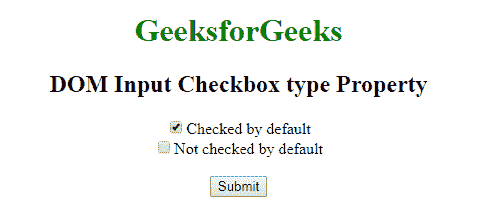
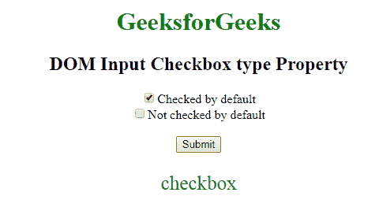

# HTML | DOM 输入复选框类型属性

> 原文:[https://www . geesforgeks . org/html-DOM-input-checkbox-type-property/](https://www.geeksforgeeks.org/html-dom-input-checkbox-type-property/)

HTML DOM 中的**输入复选框类型属性**用于返回复选框是哪种类型的表单元素。对于复选框输入字段，此属性始终只返回“复选框”。

**语法:**

```html
checkboxObject.type
```

**返回值:**它返回一个字符串值，代表复选框中表单元素的类型。

**示例:**本示例返回输入复选框类型属性。

```html
<!DOCTYPE html> 
<html> 
    <head> 
        <title>
            DOM Input Checkbox type Property
        </title> 
    </head> 

    <body style = "text-align: center;"> 

        <h1 style = "color:green;">
            GeeksforGeeks
        </h1> 

        <h2>DOM Input Checkbox type Property</h2> 

        <form > 
            <!-- Below input elements have attribute
                checked -->
            <input type="checkbox" name="check" id="GFG" 
                    value="1" checked>Checked by default<br> 

            <input type="checkbox" name="check" value="2">
                    Not checked by default<br> 
        </form> <br>

        <button onclick="myGeeks()">
            Submit
        </button>

        <p id="sudo" style="color:green;font-size:25px;"></p>

        <!-- Script to return Input Checkbox type attribute -->
        <script>
            function myGeeks() {
                var g = document.getElementById("GFG").type
                document.getElementById("sudo").innerHTML = g;
            }
        </script>
    </body> 
</html>                          
```

**输出:**
**点击按钮前:**

**点击按钮后:**


**支持的浏览器:**T2 DOM 输入复选框类型属性支持的浏览器如下:

*   谷歌 Chrome
*   微软公司出品的 web 浏览器
*   火狐浏览器
*   歌剧
*   旅行队