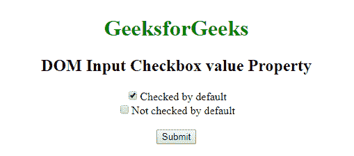
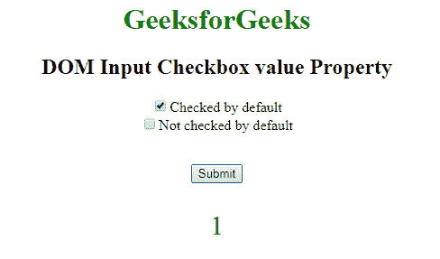
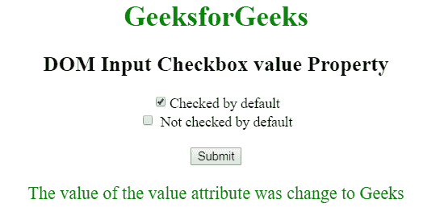

# HTML | DOM 输入复选框值属性

> 原文:[https://www . geesforgeks . org/html-DOM-input-checkbox-value-property/](https://www.geeksforgeeks.org/html-dom-input-checkbox-value-property/)

HTML DOM 中的**输入复选框值属性**用于设置或返回输入复选框字段的值属性的值，但是值属性的内容不会显示给用户。当用户提交表单时，该值和其他信息被发送到服务器。但是当复选框处于未选中状态时，将不会发送任何信息。

**语法:**

*   它返回输入复选框值属性。

    ```html
    checkboxObject.value
    ```

*   它用于设置输入复选框值属性。

    ```html
    checkboxObject.value = text
    ```

**属性值:**包含单值**文本**，用于指定与输入复选框字段关联的值。

**返回值:**返回一个字符串值，代表输入复选框字段的值属性的值。

**示例 1:** 本示例返回输入复选框值属性。

```html
<!DOCTYPE html>
<html> 
    <head> 
        <title>
            DOM Input Checkbox value Property
        </title>
    </head> 

    <body style = "text-align: center;"> 

        <h1 style = "color:green;">
            GeeksforGeeks
        </h1> 

        <h2>DOM Input Checkbox value Property</h2> 

        <form > 

            <!-- Below input elements have attribute
                checked -->
            <input type="checkbox" name="check" id="GFG" 
                    value="1" checked>Checked by default<br> 
            <input type="checkbox" name="check" value="2">
                    Not checked by default<br> 
        </form> <br>

        <button onclick="myGeeks()">
            Submit
        </button>

        <p id="sudo" style="color:green;font-size:30px;"></p>

        <!-- script to return Input Checkbox value Property -->
        <script>
            function myGeeks() {
                var g = document.getElementById("GFG").value;
                document.getElementById("sudo").innerHTML = g;
            }
        </script>
    </body> 
</html>                    
```

**输出:**
**点击按钮前:**

**点击按钮后:**


**示例 2:** 本示例设置输入复选框值属性。

```html
<!DOCTYPE html> 
<html> 
    <head> 
        <title>
            DOM Input Checkbox value Property
        </title>
    </head> 

    <body style = "text-align: center;"> 

        <h1 style = "color: green;">
            GeeksforGeeks
        </h1> 

        <h2>DOM Input Checkbox value Property</h2> 

        <form > 

            <!-- Below input elements have attribute
                checked -->
            <input type="checkbox" name="check" id="GFG" 
                    value="1" checked>Checked by default<br> 

            <input type="checkbox" name="check" value="2">
                    Not checked by default<br> 
        </form> <br>

        <button onclick="myGeeks()">
            Submit
        </button>

        <p id="sudo" style="color:green;font-size:20px;"></p>

        <!-- Script to set Input Checkbox value Property -->
        <script>
            function myGeeks() {
                var g = document.getElementById("GFG").value
                        ="Geeks";

                document.getElementById("sudo").innerHTML
                        = "The value of the value attribute"
                          + " was change to " + g;
            }
        </script>
    </body> 
</html>                    
```

**输出:**
**点击按钮前:**

**点击按钮后:**


**支持的浏览器:****DOM Input Checkbox 值属性**支持的浏览器如下:

*   谷歌 Chrome
*   微软公司出品的 web 浏览器
*   火狐浏览器
*   歌剧
*   旅行队