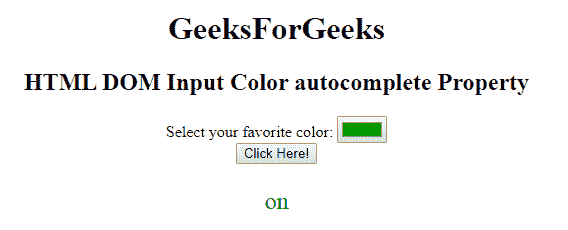
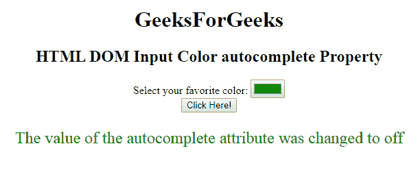

# HTML | DOM 输入颜色自动完成属性

> 原文:[https://www . geesforgeks . org/html-DOM-input-color-autocomplete-property/](https://www.geeksforgeeks.org/html-dom-input-color-autocomplete-property/)

HTML DOM 中的**输入颜色自动完成属性**用于设置或返回输入颜色字段的自动完成属性的值。自动完成属性用于指定自动完成属性的值是“开”还是“关”。当“自动完成”属性设置为“开”时，浏览器将根据用户之前输入的值自动完成。

**语法:**

*   它返回输入网址自动完成属性。

    ```html
    colorObject.autocomplete
    ```

*   它用于设置输入网址自动完成属性。

    ```html
    colorObject.autocomplete = "on|off" 
    ```

**属性值:**包含以下两个值:

*   **开:**为默认值。它会自动完成这些值。
*   **off:** 定义用户应填写 URL 输入字段的值。它不会自动完成这些值。

**返回值:**返回一个代表自动完成状态的字符串值。

**示例 1:** 本示例说明如何返回 Input 颜色自动完成属性。

```html
<!DOCTYPE html> 
<html> 

<head> 
    <title> 
        HTML DOM Input Color autocomplete Property 
    </title> 
</head> 

<body style="text-align:center;"> 
    <h1> 
        GeeksForGeeks 
    </h1> 

    <h2> 
        HTML DOM Input Color autocomplete Property 
    </h2> 

    <form id="myGeeks"> 
        <label> 
            Select your favorite color: 
        </label> 

        <input type="color" value="#009900"
                name="Geek_color" id="color"
                autocomplete="on"> 
    </form> 

    <button onclick="myGeeks()"> 
        Click Here! 
    </button> 

    <p id="GFG" style=
            "color:green;font-size:24px;"> 
    </p> 

    <script> 
        function myGeeks() { 
            var x = 
            document.getElementById("color").autocomplete; 

            document.getElementById("GFG").innerHTML = x; 
        } 
    </script> 
</body> 

</html>
```

**输出:**

*   **点击按钮前:**
    
*   **点击按钮后:**
    

**示例 2:** 本示例说明如何设置输入颜色自动完成属性。

```html

<!DOCTYPE html> 
<html> 

<head> 
    <title> 
        HTML DOM Input Color autocomplete Property 
    </title> 
</head> 

<body style="text-align:center;"> 
    <h1> 
        GeeksForGeeks 
    </h1> 

    <h2> 
        HTML DOM Input Color autocomplete Property 
    </h2> 

    <form id="myGeeks"> 
        <label> 
            Select your favorite color: 
        </label> 

        <input type="color" value="#009900"
            name="Geek_color" id="color"
            autocomplete="on"> 
    </form> 

    <button onclick="myGeeks()"> 
        Click Here! 
    </button> 

    <p id="GFG" style=
        "color:green;font-size:24px;"> 
    </p> 

    <script> 
        function myGeeks() { 
            var x = 
            document.getElementById("color").autocomplete
                    = "off"; 

            document.getElementById("GFG").innerHTML
                    = "The value of the autocomplete "
                    + "attribute was changed to " + x; 
        } 
    </script> 
</body> 

</html>
```

**输出:**

*   **点击按钮前:**
    
*   **点击按钮后:**
    

**支持的浏览器:****HTML DOM 输入颜色自动完成属性**支持的浏览器如下:

*   谷歌 Chrome
*   火狐浏览器
*   歌剧