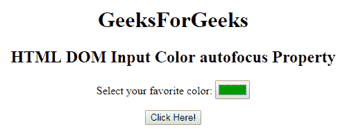
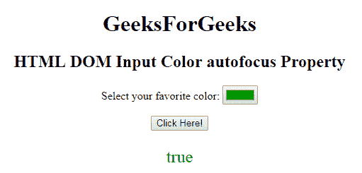
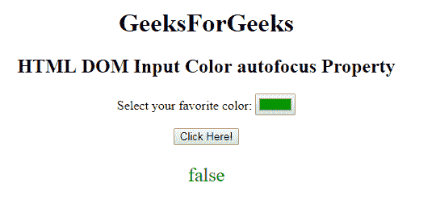

# HTML | DOM 输入颜色自动对焦属性

> 原文:[https://www . geesforgeks . org/html-DOM-input-color-autofocus-property/](https://www.geeksforgeeks.org/html-dom-input-color-autofocus-property/)

HTML DOM 中的 **DOM 输入颜色自动聚焦属性**用于**设置**或**返回**当页面加载时，颜色选择器是否应该自动获得焦点。此属性用于反映 HTML 自动对焦属性。

**语法:**

*   它返回自动对焦属性。

    ```html
    colorObject.autofocus
    ```

*   它用于设置自动对焦属性。

    ```html
    colorObject.autofocus = true|false
    ```

**属性值:**

*   **true:** 拾色器获得自动对焦。
*   **false:** 有默认值。拾色器无法获得焦点。

**返回值:**返回一个布尔值，表示页面加载时颜色选择器是否获得焦点。

**例-1:** 本例说明了如何**归还**房产。

```html
<!DOCTYPE html>
<html>

<head>
    <title>
        HTML DOM Input Color autofocus Property
    </title>
</head>

<body style="text-align:center;">
    <h1>
        GeeksForGeeks
    </h1>
    <h2> 
        HTML DOM Input Color autofocus Property 
    </h2>

    <form id="myGeeks">
        <label>
            Select your favorite color:
        </label>
        <input type="color"
               value="#009900"
               name="Geek_color"
               id="color" 
               autofocus>
    </form>

    <button onclick="myGeeks()">
        Click Here!
    </button>

    <p id="GFG" 
       style="color:green;
              font-size:24px;">
    </p>

    <script>
        function myGeeks() {
            var x =
                document.getElementById(
                    "color").autofocus;

            document.getElementById(
                "GFG").innerHTML = x;
        }
    </script>
</body>

</html>
```

**输出:**
**点击按钮前:**


**点击按钮后:**


**示例-2:** 本示例说明如何**设置**属性。

```html
<!DOCTYPE html>
<html>

<head>
    <title>
        HTML DOM Input Color autofocus Property
    </title>
</head>

<body style="text-align:center;">
    <h1>
        GeeksForGeeks
    </h1>
    <h2> 
        HTML DOM Input Color autofocus Property 
    </h2>

    <form id="myGeeks">
        <label>
          Select your favorite color:
      </label>
        <input type="color" 
               value="#009900"
               name="Geek_color"
               id="color"
               autofocus>
    </form>

    <button onclick="myGeeks()">
        Click Here!
    </button>

    <p id="GFG"
       style="color:green;
              font-size:24px;">
  </p>

    <script>
        function myGeeks() {
            var x = 
                document.getElementById(
                  "color").autofocus = false;

            document.getElementById(
              "GFG").innerHTML = x;
        }
    </script>
</body>

</html>
```

**输出:**

**点击按钮前:**


**点击按钮后:**


**支持的浏览器:**T2 DOM 输入颜色自动对焦属性支持的浏览器如下:

*   谷歌 Chrome
*   Internet Explorer 10.0 +
*   火狐浏览器
*   歌剧
*   旅行队