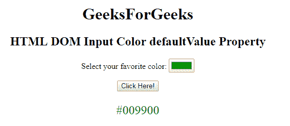
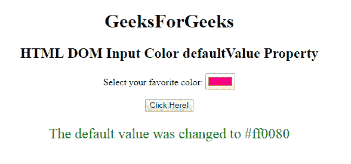

# HTML | DOM 输入颜色默认值属性

> 原文:[https://www . geesforgeks . org/html-DOM-input-color-defaultvalue-property/](https://www.geeksforgeeks.org/html-dom-input-color-defaultvalue-property/)

HTML DOM 中的 **DOM 输入颜色默认值属性**用于**设置**或**返回** *颜色选择器的默认值*。它是在 value 属性中指定的值。

**语法:**

*   它返回 defaultValue 属性。

    ```html
    colorObject.defaultValue
    ```

*   它用于设置 defaultValue 属性。

    ```html
    colorObject.defaultValue = value
    ```

**属性值:**

*   **值:**指定颜色选择器的默认值。

**返回值:**以字符串形式返回**颜色选择器**的值。

**示例-1:** 本示例返回输入颜色属性的默认值。

```html
<!DOCTYPE html>
<html>

<head>
    <title>
        HTML DOM Input Color defaultValue Property
    </title>
</head>

<body style="text-align:center;">
    <h1>
        GeeksForGeeks
    </h1>
    <h2> 
        HTML DOM Input Color defaultValue Property 
    </h2>

        <form id="myGeeks">
            <label>
              Select your favorite color: 
          </label>
            <input type="color"
                   value="#009900"
                   name="Geek_color"
                   id="color"
                   disabled>
        </form>

    <button onclick="myGeeks()">
        Click Here!
    </button>

    <p id="GFG" 
       style="color:green;
              font-size:24px;">
  </p>

    <script>
        function myGeeks() {
            var x = 
                document.getElementById(
                  "color").defaultValue;

            document.getElementById(
              "GFG").innerHTML = x;
        }
    </script>
</body>

</html>
```

**输出:**

**点击按钮前:**


**点击按钮后:**


**例-2:** 该属性说明如何**设置**属性。

```html
<!DOCTYPE html>
<html>

<head>
    <title>
        HTML DOM Input Color defaultValue Property
    </title>
</head>

<body style="text-align:center;">
    <h1>
        GeeksForGeeks
    </h1>
    <h2> 
        HTML DOM Input Color defaultValue Property 
    </h2>

        <form id="myGeeks">
            <label>
              Select your favorite color:
          </label>
            <input type="color" 
                   value="#009900" 
                   name="Geek_color" 
                   id="color" 
                   disabled>
        </form>

    <button onclick="myGeeks()">
        Click Here!
    </button>

    <p id="GFG" 
       style="color:green;
              font-size:24px;">
  </p>

    <script>
        function myGeeks() {
            var x = 
                document.getElementById(
                  "color").defaultValue = "#ff0080";

            document.getElementById(
              "GFG").innerHTML = 
              "The default value was changed to " + x;
        }
    </script>
</body>

</html>
```

**输出:**

**点击按钮前:**


**点击按钮后:**


**支持的浏览器:**T2 DOM 输入颜色默认值属性支持的浏览器如下:

*   谷歌 Chrome
*   Internet Explorer 10.0 +
*   火狐浏览器
*   歌剧
*   旅行队