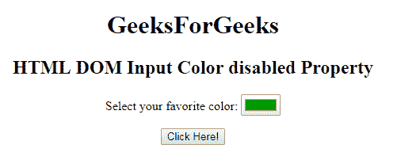

# HTML | DOM 输入颜色禁用属性

> 原文:[https://www . geesforgeks . org/html-DOM-input-color-disabled-property/](https://www.geeksforgeeks.org/html-dom-input-color-disabled-property/)

HTML DOM 中的 **DOM 输入颜色禁用属性**用于**设置**或**返回** *是否禁用颜色选择器*。禁用的元素通常不可用且不可点击，在所有浏览器中默认情况下通常是灰色的。该属性用于反映 **HTML 禁用属性。**

**语法:**

*   它用于返回禁用的属性。

    ```html
    colorObject.disabled
    ```

*   它用于设置禁用属性。

    ```html
    colorObject.disabled = true|false
    ```

**属性值:**

*   **true:** 指定禁用拾色器。
*   **假:**有默认值。它定义了颜色选择器不会被禁用。

**返回值:**返回一个布尔值，表示颜色选择器是否被禁用。

**例-1:** 本例说明了如何**归还**房产。

```html
<!DOCTYPE html>
<html>

<head>
    <title>
        HTML DOM Input Color disabled Property
    </title>
</head>

<body style="text-align:center;">
    <h1>
        GeeksForGeeks
    </h1>
    <h2> 
        HTML DOM Input Color disabled Property 
    </h2>

        <form id="myGeeks">
            <label>
              Select your favorite color:
          </label>
            <input type="color"
                   value="#009900"
                   name="Geek_color"
                   id="color"
                   disabled>
        </form>

    <button onclick="myGeeks()">
        Click Here!
    </button>

    <p id="GFG" 
       style="color:green;
              font-size:24px;">
  </p>

    <script>
        function myGeeks() {
            var x = 
                document.getElementById(
                  "color").disabled;

            document.getElementById(
              "GFG").innerHTML = x;
        }
    </script>
</body>

</html>
```

**输出:**

**点击按钮前:**


**点击按钮后:**


**示例-2:** 本示例说明如何**设置**属性。

```html
<!DOCTYPE html>
<html>

<head>
    <title>
        HTML DOM Input Color disabled Property
    </title>
</head>

<body style="text-align:center;">
    <h1>
        GeeksForGeeks
    </h1>
    <h2> 
        HTML DOM Input Color disabled Property 
    </h2>

        <form id="myGeeks">
            <label>
              Select your favorite color:
          </label>
            <input type="color"
                   value="#009900" 
                   name="Geek_color" 
                   id="color"
                   disabled>
        </form>

    <button onclick="myGeeks()">
        Click Here!
    </button>

    <p id="GFG"
       style="color:green;
              font-size:24px;">
  </p>

    <script>
        function myGeeks() {

            var x = 
                document.getElementById(
                  "color").disabled = false;

            document.getElementById("GFG").innerHTML = x;
        }
    </script>
</body>

</html>
```

**输出:**

**点击按钮前:**


**点击按钮后:**


**支持的浏览器:****DOM 输入颜色禁用属性**支持的浏览器如下:

*   谷歌 Chrome
*   Internet Explorer 10.0 +
*   火狐浏览器
*   歌剧
*   旅行队