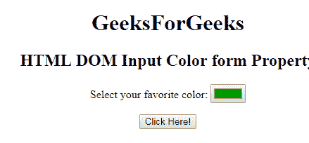
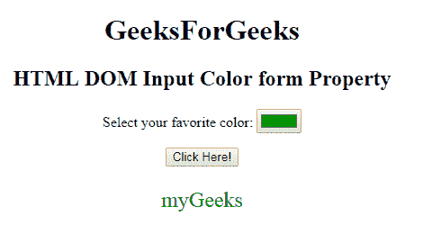

# HTML | DOM 输入颜色表单属性

> 原文:[https://www . geesforgeks . org/html-DOM-input-color-form-property/](https://www.geeksforgeeks.org/html-dom-input-color-form-property/)

HTML DOM 中的 **DOM 输入颜色表单属性**用于**返回** *对包含输入颜色选择器字段*的表单的引用。成功时返回表单对象的是只读属性。
**语法:**

```html
colorObject.form
```

**返回值**:返回一个字符串值，指定包含输入颜色字段的表单的引用。

**示例:**下面的程序说明了输入颜色表单属性的使用。

## 超文本标记语言

```html
<!DOCTYPE html>
<html>

<head>
    <title>
        HTML DOM Input Color form Property
    </title>
</head>

<body style="text-align:center;">
    <h1>
        GeeksForGeeks
    </h1>
    <h2>
        HTML DOM Input Color form Property
    </h2>
        <form id="myGeeks">
            <label>
              Select your favorite color:
          </label>
            <input type="color"
                   value="#009900"
                   name="Geek_color"
                   id="color">
        </form>

    <button onclick="myGeeks()">
        Click Here!
    </button>

    <p id="GFG"
       style="color:green;
              font-size:24px;">
  </p>

    <script>
        function myGeeks() {
            var x =
                document.getElementById(
                  "color").form.id;

            document.getElementById(
              "GFG").innerHTML = x;
        }
    </script>
</body>

</html>
```

**输出:**
**点击按钮前:**



**接通按钮后:**



**支持的浏览器:**以下所列 **DOM 输入颜色表单属性**支持的浏览器:

*   谷歌 Chrome
*   Internet Explorer 10.0 +
*   火狐浏览器
*   歌剧
*   旅行队