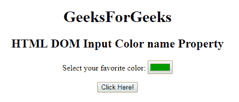
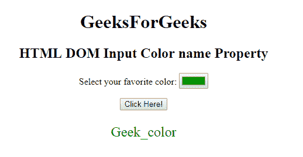
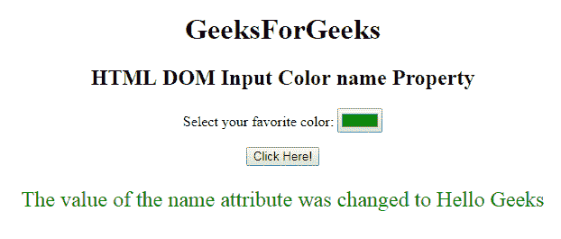

# HTML | DOM 输入颜色名称属性

> 原文:[https://www . geesforgeks . org/html-DOM-input-color-name-property/](https://www.geeksforgeeks.org/html-dom-input-color-name-property/)

HTML DOM 中的 **DOM 输入颜色名称属性**用于**设置**或**返回** *名称属性*的值。每个输入月份字段都需要名称属性。
如果没有在输入字段中指定名称属性，则根本不会发送该字段的数据。

**语法:**

*   它返回输入颜色名称属性。

    ```html
    colorObject.name
    ```

*   它用于设置输入颜色名称属性。

    ```html
    colorObject.name = name
    ```

**属性值:**它包含单个属性值，即用于指定颜色字段名称的名称。

**返回值:**返回一个代表输入颜色字段名称的字符串值。

**示例-1:** 本示例返回输入颜色名称属性。

```html
<!DOCTYPE html>
<html>

<head>
    <title>
        HTML DOM Input Color name Property
    </title>
</head>

<body style="text-align:center;">
    <h1>
        GeeksForGeeks
    </h1>
    <h2> 
        HTML DOM Input Color name Property 
    </h2>

    <p>
        Select your favorite color:
        <input type="color"
               value="#009900"
               name="Geek_color"
               id="color">
    </p>

    <button onclick="myGeeks()">
        Click Here!
    </button>

    <p id="GFG" 
       style="color:green;
              font-size:24px;">
  </p>

    <!-- script to return 
     the input color -->
    <script>
        function myGeeks() {
            var x = 
                document.getElementById(
                  "color").name;

            document.getElementById(
              "GFG").innerHTML = x;
        }
    </script>
</body>

</html>
```

**输出:**

**点击按钮前:**


**点击按钮后:**


**示例-2:** 本示例说明如何**设置**名称属性。

```html
<!DOCTYPE html>
<html>

<head>
    <title>
        HTML DOM Input Color name Property
    </title>
</head>

<body style="text-align:center;">
    <h1>
        GeeksForGeeks
    </h1>
    <h2> 
        HTML DOM Input Color name Property 
    </h2>

    <p>
        Select your favorite color:
        <input type="color"
               value="#009900"
               name="Geek_color"
               id="color">
    </p>

    <button onclick="myGeeks()">
        Click Here!
    </button>

    <p id="GFG" 
       style="color:green;
              font-size:24px;">
  </p>

    <!-- script to return the input color -->
    <script>
        function myGeeks() {
            var x = 
                document.getElementById(
                  "color").name = "Hello Geeks";

            document.getElementById(
              "GFG").innerHTML = 
              "The value of the name attribute"+
              " was changed to " + x;
        }
    </script>
</body>

</html>
```

**输出:**
**点击按钮前:**


**点击按钮后:**


**支持的浏览器:****DOM 输入颜色名称属性**支持的浏览器如下:

*   谷歌 Chrome
*   Internet Explorer 10.0 +
*   火狐浏览器
*   歌剧
*   旅行队