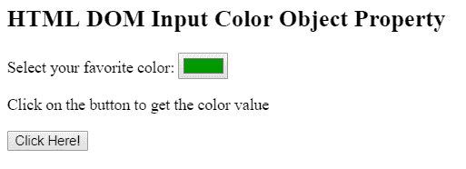
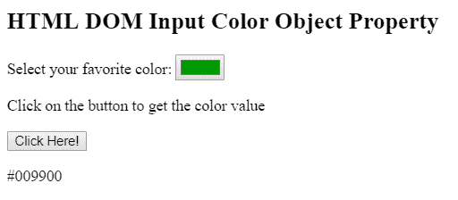

# HTML | DOM 输入颜色对象

> 原文:[https://www.geeksforgeeks.org/html-dom-input-color-object/](https://www.geeksforgeeks.org/html-dom-input-color-object/)

HTML DOM 中的**输入颜色对象属性**用于创建和访问对象内的<输入>元素。<输入>用于在输入栏中输入数据。允许用户输入数据的输入控件的声明可以通过<输入>元素来完成，这些元素在<表单>中使用。

**语法:**

*   用于访问<iframe>元素。<pre>var x = document.getElementById("myColor");</pre></iframe>
*   用于创建<iframe>元素。<pre>var x = document.createElement("INPUT");</pre></iframe>

**属性值:**

*   **自动完成:**用于设置或返回拾色器的自动完成属性。
*   **自动对焦:**用于页面自动对焦时设置或返回拾色器。
*   **默认值:**用于设置或返回拾色器的默认值。
*   **禁用:**用于设置或返回拾色器是否禁用。
*   **表单:**返回包含拾色器的表单的引用。
*   **列表:**返回包含拾色器的元素的引用。
*   **名称:**用于设置或返回拾色器的名称属性。
*   **类型:**返回拾色器的表单元素类型。
*   **值:**用于设置或返回拾色器的值属性。

**示例 1:** 本示例描述了使用 getElementById()方法访问具有 type = "color "属性的<输入>元素。

```html
<!DOCTYPE html>
<html>

<head>
    <title> 
        HTML DOM Input Color Object Property 
    </title>
</head>

<body>

    <h2>
        HTML DOM Input Color Object Property 
    </h2>

    <p>
        Select your favorite color: 
        <input type = "color" value = "#009900"
            id = "color">
    </p>

    <p>Click on the button to get the color value</p>

    <button onclick = "myGeeks()">
        Click Here!
    </button>

    <p id = "GFG"></p>

    <!-- script to return the input color -->
    <script>
        function myGeeks() {
            var x = document.getElementById("color").value;
            document.getElementById("GFG").innerHTML = x;
        }
    </script>
</body>

</html>                    
```

**输出:**
**点击按钮前:**

**点击按钮后:**


**示例 2:** 本示例描述了 document.createElement()方法来创建具有 type = "color "属性的<输入>元素。

```html
<!DOCTYPE html>
<html>

<head>
    <title> 
        HTML DOM Input Color Object Property 
    </title>
</head>

<body>

    <h2>
        HTML DOM Input Color Object Property 
    </h2>

    <button onclick = "myGeeks()">
        Click Here!
    </button>

    <!-- script to create input color element -->
    <script>
        function myGeeks() {

            /* Create input element */
            var x = document.createElement("INPUT");

            /* Set color attribute */
            x.setAttribute("type", "color");

            /* Set clor value */
            x.setAttribute("value", "#009900");

            document.body.appendChild(x);
        }
    </script>
</body>

</html>                    
```

**输出:**
**点击按钮前:**

**点击按钮后:**


**支持的浏览器:***DOM 输入颜色对象属性*支持的浏览器如下:

*   谷歌 Chrome
*   微软公司出品的 web 浏览器
*   火狐浏览器
*   旅行队
*   歌剧

**注意:**Internet Explorer 11.0 及更早版本或 Safari 9.1 及更早版本不支持。