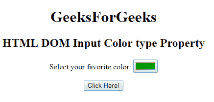
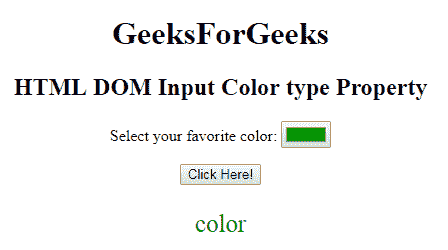

# HTML | DOM 输入颜色类型属性

> 原文:[https://www . geesforgeks . org/html-DOM-input-color-type-property/](https://www.geeksforgeeks.org/html-dom-input-color-type-property/)

HTML DOM 中的 **DOM 输入颜色类型属性**用于**返回** *，其中包含颜色选择器的表单元素类型为*。该属性将始终返回“颜色”。
**语法:**

```html
colorObject.type 
```

**返回值:**返回一个字符串值，代表输入颜色字段的表单元素类型。

**下面的程序说明了输入颜色类型属性的使用。**
**例:**

## 超文本标记语言

```html
<!DOCTYPE html>
<html>

<head>
    <title>
        HTML DOM Input Color type Property
    </title>
</head>

<body style="text-align:center;">
    <h1>
        GeeksForGeeks
    </h1>
    <h2>
        HTML DOM Input Color type Property
    </h2>

<p>
        Select your favorite color:
        <input type="color"
               value="#009900"
               id="color">
    </p>

    <button onclick="myGeeks()">
        Click Here!
    </button>

    <p id="GFG"
       style="color:green;
              font-size:25px;">
  </p>

    <!-- script to return
     the input color -->
    <script>
        function myGeeks() {
            var x =
                document.getElementById(
                  "color").type;

            document.getElementById(
              "GFG").innerHTML = x;
        }
    </script>
</body>

</html>
```

**输出:点击按钮前:**



**点击按钮后:**



**支持的浏览器:**下面列出的 **DOM 输入颜色类型属性**支持的浏览器:

*   谷歌 Chrome
*   Internet Explorer 10.0 +
*   火狐浏览器
*   歌剧
*   旅行队