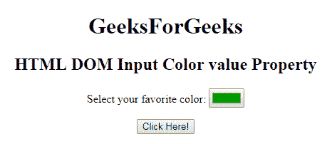
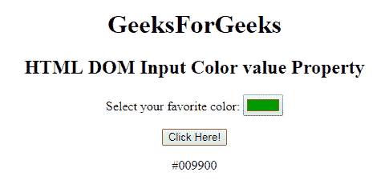
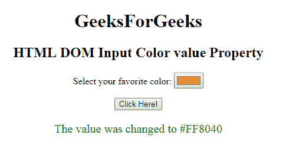

# HTML | DOM 输入颜色值属性

> 原文:[https://www . geesforgeks . org/html-DOM-input-color-value-property/](https://www.geeksforgeeks.org/html-dom-input-color-value-property/)

HTML DOM 中的 **DOM 输入颜色值属性**用于设置或返回颜色选择器的值属性的值。**值属性**用于指定颜色选择器的颜色。它的默认值是#000000(黑色)。

句法

*   它返回 value 属性。

    ```html
    colorObject.value
    ```

    *   It is used to set the value property.

    ```html
    colorObject.value = #hexvalue
    ```

    **属性值:**它包含一个值，即**#十六进制值**，指定颜色选择器的颜色。
    该值应为十六进制:3 个从#号开始的两位数。对于 eg-Hex，黑色的值是#000000。

    **返回值:**返回一个代表颜色选择器颜色的字符串值。
    **例-1:** 本例说明如何**归还**房产。

    ```html
    <!DOCTYPE html> 
    <html> 

    <head> 
        <title> 
            HTML DOM Input Color value Property 
        </title> 
    </head> 

    <body style="text-align:center;"> 
        <h1>
            GeeksForGeeks
        </h1>
        <h2> 
            HTML DOM Input Color value Property 
        </h2> 

        <p> 
            Select your favorite color: 
            <input type = "color" value = "#009900"
                id = "color"> 
        </p> 

        <button onclick = "myGeeks()"> 
            Click Here! 
        </button> 

        <p id = "GFG"></p> 

        <!-- script to return the input color -->
        <script> 
            function myGeeks() { 
                var x = document.getElementById("color").value; 
                document.getElementById("GFG").innerHTML = x; 
            } 
        </script> 
    </body> 

    </html>                     
    ```

    **输出:**
    **点击按钮前:**
    
    **点击按钮后:**
    
    **示例-2:** 本示例说明如何**设置**属性。

    ```html
    <!DOCTYPE html> 
    <html> 

    <head> 
        <title> 
            HTML DOM Input Color value Property 
        </title> 
    </head> 

    <body style="text-align:center;"> 
        <h1>
            GeeksForGeeks
        </h1>
        <h2> 
            HTML DOM Input Color value Property 
        </h2> 

        <p> 
            Select your favorite color: 
            <input type = "color" value = "#009900"
                id = "color"> 
        </p> 

        <button onclick = "myGeeks()"> 
            Click Here! 
        </button> 

        <p id = "GFG" style="font-size:20px;color:green;"></p> 

        <!-- script to return the input color -->
        <script> 
            function myGeeks() { 
                var x = document.getElementById("color").value = "#FF8040"; 
                document.getElementById("GFG").innerHTML = 
                   "The value was changed to " + x; 
            } 
        </script> 
    </body> 

    </html>                     
    ```

    **输出:**
    **点击按钮前:**
    
    **点击按钮后:**
    

    **支持的浏览器:**下面列出的 **DOM 输入颜色值属性**支持的浏览器:

    *   谷歌 Chrome
    *   Internet Explorer 10.0 +
    *   火狐浏览器
    *   歌剧
    *   旅行队