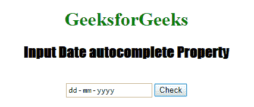
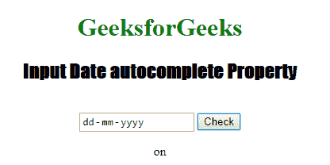
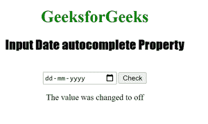

# HTML | DOM 输入日期自动完成属性

> 原文:[https://www . geesforgeks . org/html-DOM-input-date-autocomplete-property/](https://www.geeksforgeeks.org/html-dom-input-date-autocomplete-property/)

HTML DOM 中的**输入日期自动完成属性**用于设置或返回输入日期字段的自动完成属性值。自动完成属性用于指定自动完成属性的值是“开”还是“关”。当“自动完成”属性设置为“开”时，浏览器将根据用户之前输入的值自动完成。
**语法:**

*   它返回输入日期自动完成属性。

```html
DateObject.autocomplete
```

*   它用于设置输入日期自动完成属性。

```html
DateObject.autocomplete = "on|off" 
```

**属性值:**包含以下两个值:

*   **开:**为默认值。它会自动完成这些值。
*   **off:** 定义用户用 URL 输入字段填充值。它不会自动完成这些值。

**返回值:**返回一个代表自动完成状态的字符串值。
**示例 1:** 本示例返回输入日期自动完成属性。

## 超文本标记语言

```html
<!DOCTYPE html>
<html>

<head>
    <title>
        HTML DOM Input Date autocomplete Property
    </title>
</head>

<body style="text-align:center;">

    <h1 style="color: green;">
        GeeksforGeeks
    </h1>

    <h2 style="font-family: Impact;">
        Input Date autocomplete Property
    </h2>
    <br>

    <input type="date" id="test_Date" autocomplete="on">

    <button ondblclick="My_Date()">Check</button>

    <p id="test"></p>

    <script>
        function My_Date() {
            var d = document.getElementById(
                        "test_Date").autocomplete;

            document.getElementById("test").innerHTML
                        = d;
        }
    </script>

</body>

</html>                               
```

**输出:**

*   **点击按钮前:**



*   **点击按钮后:**



**示例 2:** 本示例设置输入日期自动完成属性。

## 超文本标记语言

```html
<!DOCTYPE html>
<html>

<head>
    <title>
        HTML DOM Input Date autocomplete Property
    </title>
</head>

<body style="text-align:center;">

    <h1 style="color: green;">
        GeeksforGeeks
    </h1>

    <h2 style="font-family: Impact;">
        Input Date autocomplete Property
    </h2>
    <br>

    <input type="date" id="test_Date" autocomplete="on">

    <button ondblclick="My_Date()">Check</button>

    <p id="test"></p>

    <script>
        function My_Date() {
            var d = document.getElementById(
                    "test_Date").autocomplete = "off";

            document.getElementById("test").innerHTML
                    = "The value was changed to " + d;
        }
    </script>
</body>

</html>              
```

**输出:**

*   **点击按钮前:**


*   **点击按钮后:**



**支持的浏览器:****HTML DOM 输入日期自动完成属性**支持的浏览器如下:

*   谷歌 Chrome
*   微软公司出品的 web 浏览器
*   火狐浏览器
*   旅行队
*   歌剧