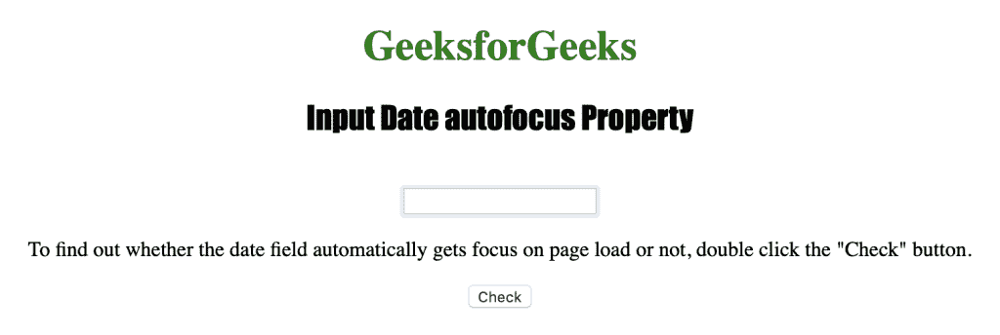
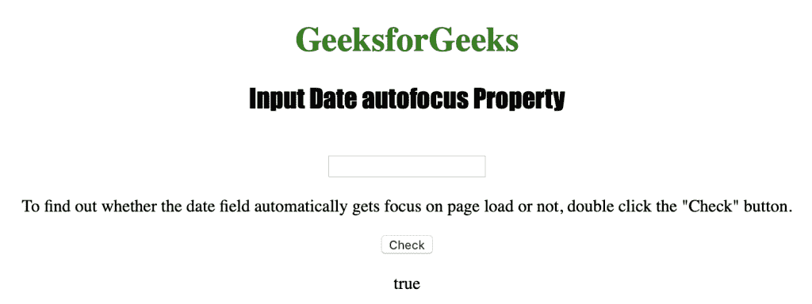
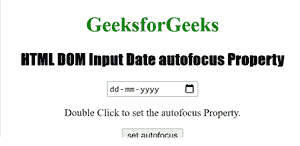
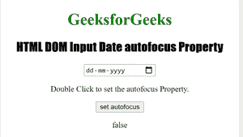

# HTML | DOM 输入日期自动对焦属性

> 原文:[https://www . geesforgeks . org/html-DOM-输入-日期-自动对焦-属性/](https://www.geeksforgeeks.org/html-dom-input-date-autofocus-property/)

**日期自动对焦**属性用于设置或返回页面加载时日期字段是否自动对焦。
如果日期字段自动关注页面的加载，则返回 true，否则返回 false。
HTML 自动对焦属性由 Date 自动对焦属性反映。
**语法:**

*   用于返回自动对焦属性:

```html
dateObject.autofocus
```

*   用于设置自动对焦属性:

```html
dateObject.autofocus = true|false
```

**房产价值:**

*   **true|false :** 用于指定页面加载时日期字段是否应该获得焦点。默认为假。

**返回值:**返回一个布尔值，表示输入日期字段是否获得焦点。

下面的程序说明了日期自动聚焦属性:
**找出日期字段是否在页面加载时自动聚焦。**
**示例-1:**

## 超文本标记语言

```html
<!DOCTYPE html>
<html>

<head>
    <title>Input Date autofocus Property in HTML</title>
    <style>
        h1 {
            color: green;
        }

        h2 {
            font-family: Impact;
        }

        body {
            text-align: center;
        }
    </style>
</head>

<body>

    <h1>GeeksforGeeks</h1>
    <h2>Input Date autofocus Property</h2>
    <br>

    <input type="date" id="test_Date" autofocus>

<p>To find out whether the date field automatically gets
      focus on page load or not, double click the "Check" button.</p>

    <button ondblclick="My_Date()">Check</button>

    <p id="test"></p>

    <script>
        function My_Date() {
            var d = document.getElementById("test_Date").autofocus;
            document.getElementById("test").innerHTML = d;
        }
    </script>

</body>

</html>

```

**输出:**
**前:**



**点击按钮后:**



**示例-2:** 下面的代码设置自动对焦属性。

## 超文本标记语言

```html
<!DOCTYPE html>
<html>

<head>
    <title>
        HTML DOM Input Date autofocus Property
    </title>

    <style>
        h1 {
            color: green;
        }

        h2 {
            font-family: Impact;
        }

        body {
            text-align: center;
        }
    </style>
</head>

<body>
    <h1>GeeksforGeeks</h1>

    <h2>
        HTML DOM Input Date autofocus Property
    </h2>

    <input type="date"
        id="test" autofocus>

<p>Double Click to set the autofocus Property.</p>

    <button ondblclick="Access()">set autofocus</button>

    <p id="check"></p>

    <script>
        function Access() {

            // Accessing input element type value
            var a = document.getElementById(
                    "test").autofocus = "false";

            document.getElementById(
                    "check").innerHTML = a;
        }
    </script>

</body>

</html>
```

**输出:**

**之前:**



**点击按钮后:**



**支持的网络浏览器:**

*   苹果 Safari
*   微软公司出品的 web 浏览器
*   火狐浏览器
*   谷歌 Chrome
*   歌剧