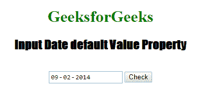
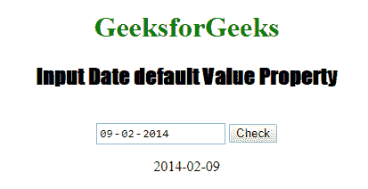
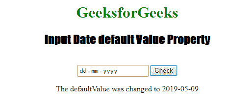

# HTML | DOM 输入日期默认值属性

> 原文:[https://www . geesforgeks . org/html-DOM-input-date-default value-property/](https://www.geeksforgeeks.org/html-dom-input-date-defaultvalue-property/)

HTML DOM 中的**输入日期默认值属性**用于设置或返回日期字段的默认值。此属性用于反映 HTML 值属性。**默认值**和**值**的主要区别在于默认值表示默认值，该值包含一些更改后的当前值。此属性对于查找日期字段是否已更改非常有用。
**语法:**

*   它用于返回 defaultValue 属性。

```html
dateObject.defaultValue
```

*   它用于设置 defaultValue 属性。

```html
dateObject.defaultValue = value
```

**属性值:**包含定义输入日期字段默认值的单个属性值。
**返回值:**返回代表输入日期字段默认值的字符串值。
**示例 1:** 本示例说明如何返回输入日期默认值属性。

## 超文本标记语言

```html
<!DOCTYPE html>
<html>

<head>
    <title>
        HTML DOM Input Date defaultValue Property
    </title>

    <style>
        h1 {
            color: green;
        }

        h2 {
            font-family: Impact;
        }

        body {
            text-align: center;
        }
    </style>
</head>

<body>
    <h1>GeeksforGeeks</h1>

    <h2>Input Date default Value Property</h2>
    <br>

    <input type="date" id="test_Date"
            value = "2014-02-09" autofocus>

    <button ondblclick="My_Date()">Check</button>

    <p id="test"></p>

    <script>
        function My_Date() {
            var d = document.getElementById("test_Date").defaultValue;
            document.getElementById("test").innerHTML = d;
        }
    </script>
</body>

</html>
```

**输出:**

*   **点击按钮前:**



*   **点击按钮后:**



**示例 2:** 本示例返回输入日期默认值属性。

## 超文本标记语言

```html
<!DOCTYPE html>
<html>

<head>
    <title>
        HTML DOM Input Date defaultValue Property
    </title>

    <style>
        h1 {
            color: green;
        }

        h2 {
            font-family: Impact;
        }

        body {
            text-align: center;
        }
    </style>
</head>

<body>
    <h1>GeeksforGeeks</h1>

    <h2>Input Date default Value Property</h2>
    <br>

    <input type="date" id="test_Date"
            value = "2014-02-09" autofocus>

    <button ondblclick="My_Date()">Check</button>

    <p id="test"></p>

    <script>
        function My_Date() {
            var d = document.getElementById(
                "test_Date").defaultValue =  " 2019-05-09"; 
            document.getElementById("test").innerHTML
                = " The defaultValue was changed to " + d;
        }
    </script>
</body>

</html>
```

**输出:**

*   **点击按钮前:**


*   **点击按钮后:**



**支持的浏览器:**HTML DOM 输入日期默认值属性支持的浏览器如下:

*   谷歌 Chrome
*   微软公司出品的 web 浏览器
*   火狐浏览器
*   旅行队
*   歌剧