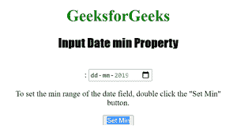

# HTML | DOM 输入日期最小属性

> 原文:[https://www . geesforgeks . org/html-DOM-input-date-min-property/](https://www.geeksforgeeks.org/html-dom-input-date-min-property/)

“输入日期最小值”属性用于设置或返回日期字段的最小值。该属性返回一个表示允许的最小日期的字符串。

**语法:**

*   要返回最小属性:

```html
inputdateObject.min
```

*   要设置最小属性:

```html
inputdateObject.min = YYYY-MM-DD
```

**属性值:**

*   **YYYY-MM-DDThh:mm:ssTZD :** 用于指定允许的最小日期和时间。
    *   YYYY:指定年份。
    *   MM:指定月份。
    *   DD:它指定了一个月中的某一天。
    *   如果还输入了时间，它会指定分隔符。
    *   hh:它指定了小时。
    *   它指定了分钟。
    *   ss:它指定了秒数。
    *   TZD:它指定了时区指示器。

**返回值:**返回一个字符串值，代表日期字段允许的最小日期。

下面的程序说明了 Date min 属性:
**示例 1:** 获取日期字段允许的最小日期。

## 超文本标记语言

```html
<!DOCTYPE html>
<html>

<head>
    <title>Input Date min Property in HTML</title>
    <style>
        h1 {
            color: green;
        }

        h2 {
            font-family: Impact;
        }

        body {
            text-align: center;
        }
    </style>
</head>

<body>

    <h1>GeeksforGeeks</h1>
    <h2>Input Date min Property</h2>
    <br>

<p>The range of date accepted is between 2019-02-18 and 2019-02-20:
        <input type="date" id="Test_Date" min="2019-02-18" max="2019-02-20">

<p>To return the min range of the date field,
          double click the "Return Min" button.</p>

        <button ondblclick="My_Date()">Return Min</button>

        <p id="test"></p>

        <script>
            function My_Date() {
                var d = document.getElementById("Test_Date").min;
                document.getElementById("test").innerHTML = d;
            }
        </script>

</body>

</html>                                          
```

**输出:**
**前:**


**点击按钮后:**


**示例-2:** 下面的代码设置输入日期最小值属性。

## 超文本标记语言

```html
<!DOCTYPE html>
<html>

<head>
    <title>Input Date min Property in HTML</title>
    <style>
        h1 {
            color: green;
        }

        h2 {
            font-family: Impact;
        }

        body {
            text-align: center;
        }
    </style>
</head>

<body>

    <h1>GeeksforGeeks</h1>
    <h2>Input Date min Property</h2>
    <br>:
        <input type="date" 
               id="Test_Date" 
               min="2019-02-18" 
               max="2019-02-20">

<p>To set  the min range of the date field,
        double click the "Set Min" button.</p>

        <button ondblclick="My_Date()">Set Min</button>

        <p id="test"></p>

        <script>
            function My_Date() {
                var d = document.getElementById("Test_Date").min = 
                    "2019-01-01";
                document.getElementById("test").innerHTML = d;
            }
        </script>

</body>

</html>
```

**之前:**



**双击按钮后:**


**支持的网络浏览器:**

*   苹果 Safari
*   微软公司出品的 web 浏览器
*   火狐浏览器
*   谷歌 Chrome
*   歌剧