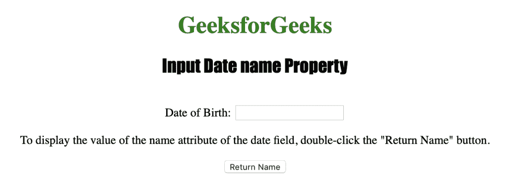
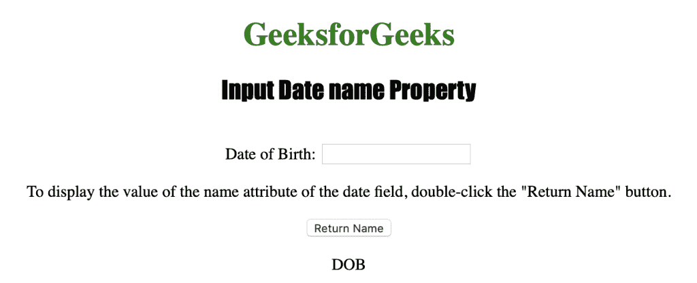

# HTML | DOM 输入日期名称属性

> 原文:[https://www . geesforgeks . org/html-DOM-input-date-name-property/](https://www.geeksforgeeks.org/html-dom-input-date-name-property/)

输入日期名称属性用于设置或返回日期字段的名称属性值。
已经提交给服务器的表单数据可以通过名称属性来识别。name 属性还用于在客户端使用 JavaScript 引用表单数据。
**语法:**

*   用于返回名称属性:

```html
inputdateObject.name
```

*   用于设置名称属性:

```html
inputdateObject.name
```

**房产价值**

*   **名称:**用于指定日期字段的名称。

**返回值:**返回一个字符串值，指定输入日期字段的名称。**T3】**

下面的程序说明了日期名称属性:
**获取日期字段的名称。**T3】

## 超文本标记语言

```html
<!DOCTYPE html>
<html>

<head>
    <title>Input Date name Property in HTML</title>
    <style>
        h1 {
            color: green;
        }

        h2 {
            font-family: Impact;
        }

        body {
            text-align: center;
        }
    </style>
</head>

<body>

    <h1>GeeksforGeeks</h1>
    <h2>Input Date name Property</h2>
    <br> Date of Birth:
    <input type="date" id="Test_Date" name="DOB">

<p>To display the value of the name attribute of the date field,
      double-click the "Return Name" button.</p>

    <button ondblclick="My_Date()">Return Name</button>

    <p id="test"></p>

    <script>
        function My_Date() {
            var n = document.getElementById("Test_Date").name;
            document.getElementById("test").innerHTML = n;
        }
    </script>

</body>

</html>

```

**输出:**



**点击**按钮后



**支持的网络浏览器**

*   苹果 Safari
*   微软公司出品的 web 浏览器
*   火狐浏览器
*   谷歌 Chrome
*   歌剧