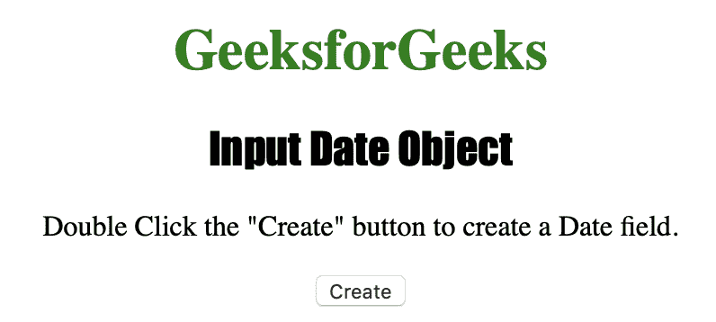
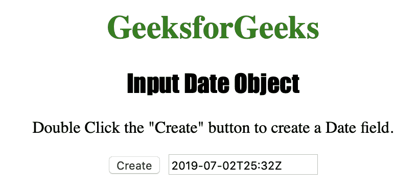
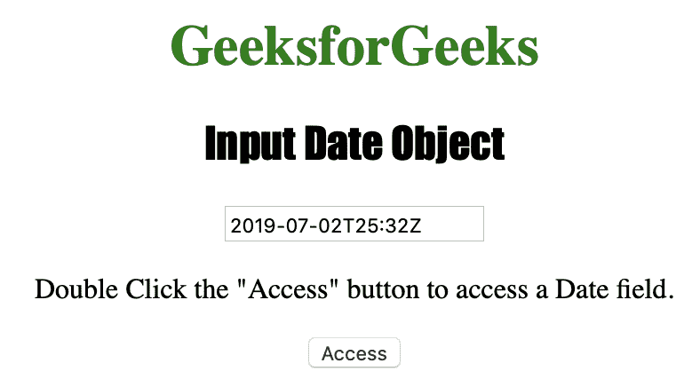
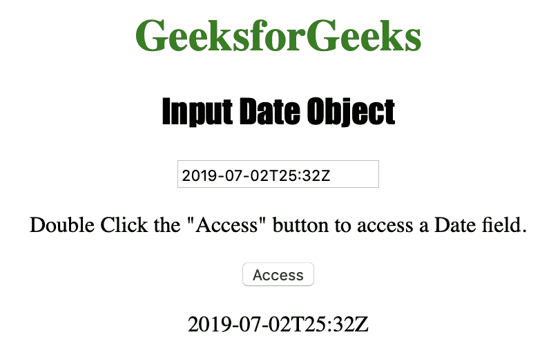

# HTML | DOM 输入日期对象

> 原文:[https://www.geeksforgeeks.org/html-dom-input-date-object/](https://www.geeksforgeeks.org/html-dom-input-date-object/)

输入日期对象用于表示**类型=“日期”**的 HTML strong <输入> 元素。
输入日期对象是 HTML5 中的一个新对象。

**语法:**

*   **用于创建<输入>元素，类型为=“日期”:**

    ```html
    var gfg = document.createElement("input") 
    gfg.setAttribute("type", "date");

    ```

*   **进入<输入>元素，类型为=“日期”:**

    ```html
    document.getElementById("date_object")
    ```

**属性值:**

| 价值 | 描述 |
| 自动完成 | 它用于设置或返回日期时间字段的自动完成属性的值。 |
| 自（动）调焦装置 | 它用于设置或返回页面加载时日期时间字段是否应自动获得焦点。 |
| 缺省值 | 它用于设置或返回日期时间字段的默认值。 |
| 有缺陷的 | 它用于设置或返回日期时间字段是否被禁用。 |
| 形式 | 它用于返回对包含日期时间字段的表单的引用。 |
| 目录 | 它用于返回对包含 datetime 字段的 datalist 的引用。 |
| 最大 | 它用于设置或返回日期时间字段的 max 属性值。 |
| 部 | 设置或返回日期时间字段的 min 属性值。 |
| 名字 | 它用于设置或返回日期时间字段的 name 属性值。 |
| 只读的 | 它用于设置或返回日期时间字段是否为只读。 |
| 需要 | 它用于设置或返回在提交表单之前是否必须填写日期时间字段。 |
| 步骤 | 它用于设置或返回日期时间字段的 step 属性值。 |
| 类型 | 它用于返回日期时间字段是哪种类型的表单元素。 |
| 价值 | 它用于设置或返回日期时间字段的 value 属性值。 |

**输入日期对象方法:**

*   **stepDown() :** 用于将日期时间字段的值递减指定的数字。
*   **stepUp() :** 用于将日期时间字段的值增加一个指定的数字。

下面的程序说明了日期对象:
**示例-1:创建一个类型为“日期”的<输入>元素。**

```html
<!DOCTYPE html>
<html>

<head>
    <title>Input Date Object</title>
    <style>
        h1 {
            color: green;
        }

        h2 {
            font-family: Impact;
        }

        body {
            text-align: center;
        }
    </style>
</head>

<body>

    <h1>GeeksforGeeks</h1>
    <h2>Input Date Object</h2>

    <p>Double Click the "Create" button 
      to create a Date field.
  </p>

    <button ondblclick="Create()">Create
  </button>

    <script>
        function Create() {

         // create input element type date.
         var c = document.createElement("INPUT");
         c.setAttribute("type", "date");
         c.setAttribute("value", "2019-07-02T25:32Z");
         document.body.appendChild(c);
        }
    </script>

</body>

</html>
```

**输出:**

**点击按钮前:**


**点击按钮后:**


**示例-2:访问类型为“= date”的<输入>元素。**

```html
<!DOCTYPE html>
<html>

<head>
    <title>Input Date Object</title>
    <style>
        h1 {
            color: green;
        }

        h2 {
            font-family: Impact;
        }

        body {
            text-align: center;
        }
    </style>
</head>

<body>

    <h1>GeeksforGeeks</h1>
    <h2>Input Date Object</h2>

    <input type="date" 
           id="test" 
           value="2019-07-02T25:32Z">

    <p>Double Click the "Access" 
      button to access a Date field.</p>

    <button ondblclick="Access()">Access
  </button>

    <p id="check"></p>

    <script>
        function Access() {

            // Accessing input element type =”date”
            var a = document.getElementById(
              "test").value;
            document.getElementById(
              "check").innerHTML = a;
        }
    </script>

</body>

</html>
```

**输出:**


**双击**
按钮后

**支持的浏览器:**

*   歌剧
*   火狐浏览器
*   谷歌 Chrome
*   苹果 Safari