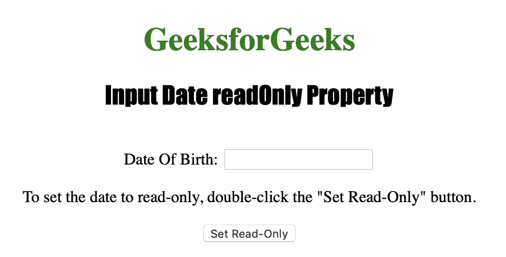
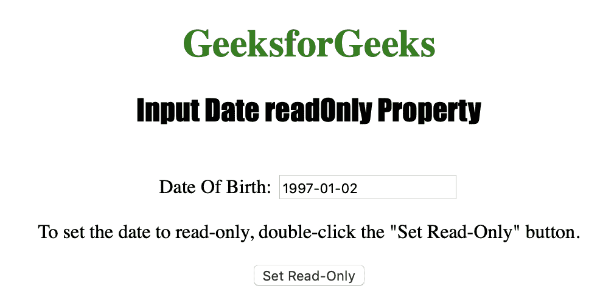
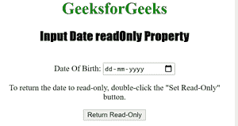
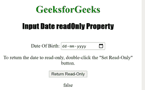

# HTML | DOM 输入日期只读属性

> 原文:[https://www . geesforgeks . org/html-DOM-input-date-readonly-property/](https://www.geeksforgeeks.org/html-dom-input-date-readonly-property/)

输入日期只读属性用于设置或返回日期字段是否应为只读。
一旦字段被声明为只读，就不能再修改。但是，只读字段可以是选项卡式的、高亮显示的，并可用于复制文本。
输入日期只读属性反映了 HTML 只读属性。

**语法:**

*   用于返回只读属性:

```html
inputdateObject.readOnly
```

*   用于设置只读属性:

```html
inputdateObject.readOnly = true|false
```

**房产价值:**

*   **true|false :** 用于指定日期字段是否为只读。

**返回值:**返回一个布尔值，表示日期字段是否为只读。

下面的程序说明了日期只读属性:
**示例 1:** 将日期字段设置为只读。

## 超文本标记语言

```html
<!DOCTYPE html>
<html>

<head>
    <title>Input Date readOnly Property in HTML</title>
    <style>
        h1 {
            color: green;
        }

        h2 {
            font-family: Impact;
        }

        body {
            text-align: center;
        }
    </style>
</head>

<body>

    <h1>GeeksforGeeks</h1>
    <h2>Input Date readOnly Property</h2>
    <br> Date Of Birth:
    <input type="date" id="Test_Date" name="DOB">

<p>To set the date to read-only, 
      double-click the "Set Read-Only" button.</p>

    <button ondblclick="My_Date()">Set Read-Only</button>

    <p id="test"></p>

    <script>
        function My_Date() {
            document.getElementById("Test_Date").readOnly = true;
        }
    </script>

</body>

</html>                                        
```

**输出:**
**前:**



**点击按钮后:**



**示例 2:** 下面的代码返回日期只读属性。

## 超文本标记语言

```html
<!DOCTYPE html>
<html>

<head>
    <title>Input Date readOnly Property in HTML</title>
    <style>
        h1 {
            color: green;
        }

        h2 {
            font-family: Impact;
        }

        body {
            text-align: center;
        }
    </style>
</head>

<body>

    <h1>GeeksforGeeks</h1>
    <h2>Input Date readOnly Property</h2>
    <br> Date Of Birth:
    <input type="date" id="Test_Date" name="DOB">

<p>To return the date to read-only, 
      double-click the "Set Read-Only" button.</p>

    <button ondblclick="My_Date()">Return Read-Only</button>

    <p id="test"></p>

    <script>
        function My_Date() {
        var g =     document.getElementById("Test_Date").readOnly;
            document.getElementById("test").innerHTML = g 
        }
    </script>

</body>

</html>                                        
```

**输出:**

**之前:**



**双击按钮后:**



**支持的网络浏览器:**

*   苹果 Safari
*   微软公司出品的 web 浏览器
*   火狐浏览器
*   谷歌 Chrome
*   歌剧