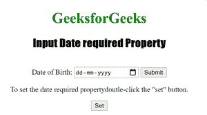

# HTML | DOM 需要输入日期属性

> 原文:[https://www . geesforgeks . org/html-DOM-input-date-required-property/](https://www.geeksforgeeks.org/html-dom-input-date-required-property/)

“需要输入日期”属性用于设置或返回在提交表单之前是否必须填写日期字段。
HTML 必选属性用于反映输入日期必选属性。
**语法:**

*   用于返回所需属性:

```html
dateObject.required
```

*   用于设置所需属性:

```html
 dateObject.required = true|false
```

**房产价值:**

*   **true|false :** 用于指定日期字段是否应该是表单提交的必需部分。

**返回值:**返回一个布尔值，表示输入日期字段是否是必需的。

下面的程序说明了“需要日期”属性:
**示例 1:** 在提交表单之前确定是否必须填写日期字段。

## 超文本标记语言

```html
<!DOCTYPE html>
<html>

<head>
    <title>Input Date required Property in HTML</title>
    <style>
        h1 {
            color: green;
        }

        h2 {
            font-family: Impact;
        }

        body {
            text-align: center;
        }
    </style>
</head>

<body>

    <h1>GeeksforGeeks</h1>
    <h2>Input Date required Property</h2>
    <br>

    <form action="/initials.php">
        Date of Birth:
        <input type="date" id="Test_Date" name="DOB" required>
        <input type="submit">
    </form>

<p>To find out if the date field must be filled out
      before submitting the form, double-click the "Check" button.</p>

    <button ondblclick="My_Date()">Check</button>

    <p id="test"></p>

    <script>
        function My_Date() {
            var d = document.getElementById("Test_Date").required;
            document.getElementById("test").innerHTML = d;
        }
    </script>

</body>

</html>

```

**输出:**


**点击按钮后:**


**示例 2:** 下面的代码设置了 date required 属性。

## 超文本标记语言

```html
<!DOCTYPE html>
<html>

<head>
    <title>Input Date required Property in HTML</title>
    <style>
        h1 {
            color: green;
        }

        h2 {
            font-family: Impact;
        }

        body {
            text-align: center;
        }
    </style>
</head>

<body>

    <h1>GeeksforGeeks</h1>
    <h2>Input Date required Property</h2>
    <br>

    <form action="/initials.php">
        Date of Birth:
        <input type="date" id="Test_Date" name="DOB" required>
        <input type="submit">
    </form>

<p>To set the date required propertydoutle-click the "set" button.</p>

    <button ondblclick="My_Date()">Set</button>

    <p id="test"></p>

    <script>
        function My_Date() {
            var d = document.getElementById("Test_Date").required = "false";
            document.getElementById("test").innerHTML = d;
        }
    </script>

</body>

</html>

```

**输出:**



**点击按钮后:**


**支持的网络浏览器:**

*   苹果 Safari
*   微软公司出品的 web 浏览器
*   火狐浏览器
*   谷歌 Chrome
*   歌剧