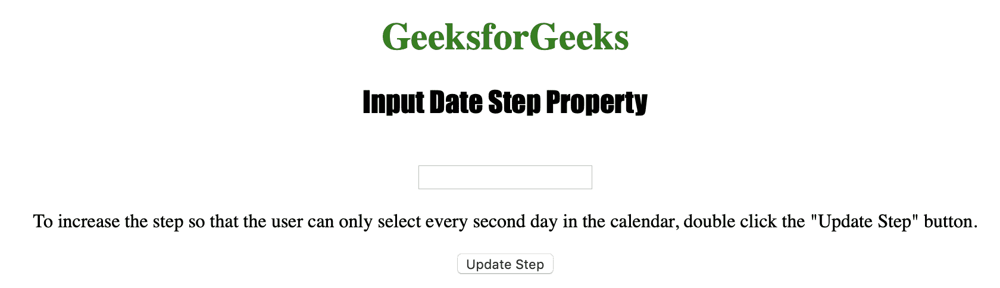
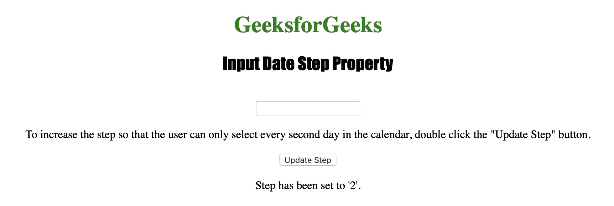

# HTML | DOM 输入日期步骤属性

> 原文:[https://www . geesforgeks . org/html-DOM-input-date-step-property/](https://www.geeksforgeeks.org/html-dom-input-date-step-property/)

**输入日期步长属性**用于设置或返回日期字段的步长属性值。
输入步骤属性可用于指定用户在日期字段中打开日历时选择的法定日期间隔。

**语法:**

*   **返回步骤属性:**

```html
inputdateObject.step
```

*   **设置步长属性:**

```html
inputdateObject.step = number
```

**属性值**

*   **数字:**用于指定法定的日间隔。默认情况下，它设置为 1。

**返回值:**返回一个数值，代表日期字段的法定日间隔。

以下程序说明了日期步长属性:
**示例:**更改法定日间隔。

## 超文本标记语言

```html
<!DOCTYPE html>
<html>

<head>
    <title>
      Input Date Step Property in HTML
  </title>
    <style>
        h1 {
            color: green;
        }

        h2 {
            font-family: Impact;
        }

        body {
            text-align: center;
        }
    </style>
</head>

<body>

    <h1>
      GeeksforGeeks
  </h1>
    <h2>
      Input Date Step Property
  </h2>
    <br>

    <input type="date"
           id="Test_Date">

<p>To increase the step so that the
      user can only select every second
      day in the calendar, double click
      the "Update Step" button.
    </p>

    <button ondblclick="My_Date()">
      Update Step
  </button>

    <p id="test"></p>

    <script>
        function My_Date() {
            document.getElementById(
              "Test_Date").step = "2";

            document.getElementById(
              "test").innerHTML =
              "Step has been set to '2'.";
        }
    </script>

</body>

</html>
```

**输出:**



**点击**按钮后



**支持的浏览器:**

*   苹果 Safari
*   微软公司出品的 web 浏览器
*   火狐浏览器
*   谷歌 Chrome
*   歌剧