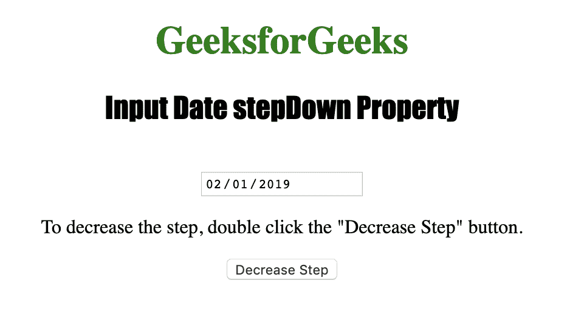
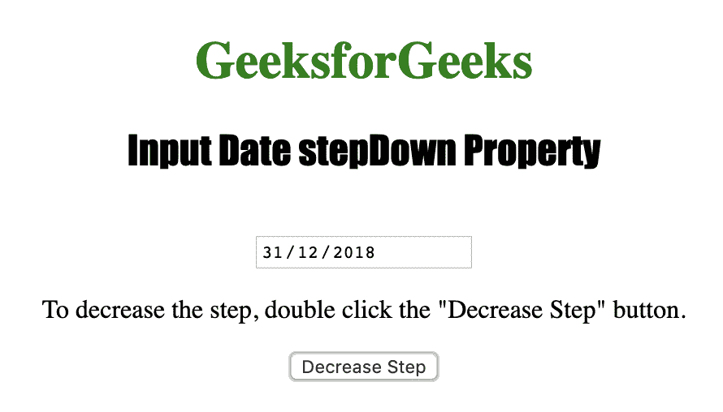

# HTML | DOM 输入日期步降( )方法

> 原文:[https://www . geesforgeks . org/html-DOM-input-date-step down-method/](https://www.geeksforgeeks.org/html-dom-input-date-stepdown-method/)

**输入日期递减()**方法用于将日期字段的值递减指定的数字。它只能在白天使用，不能在月和年使用。

**语法:**

```html
inputdateObject.stepDown(number)
```

**使用的参数:**

*   **数字:**用于指定日期字段应减少的天数。

下面的程序说明了日期递减属性:

**示例:**将日期字段的值递减 2 天。

```html
<!DOCTYPE html>
<html>

<head>
    <title>
      Input Date stepDown Property in HTML
  </title>
    <style>
        h1 {
            color: green;
        }

        h2 {
            font-family: Impact;
        }

        body {
            text-align: center;
        }
    </style>
</head>

<body>

    <h1>GeeksforGeeks</h1>
    <h2>Input Date stepDown Property
    </h2>
    <br>

    <input type="date" 
           id="Test_Date">

    <p>To decrease the step, 
      double click the "Decrease Step" button.
  </p>

    <button ondblclick="My_Date()">
      Decrease Step
  </button>

    <p id="test">
  </p>

    <script>
        function My_Date() {

            // Decrease 2 days.
            document.getElementById(
              "Test_Date").stepDown(2);
        }
    </script>

</body>

</html>
```

**输出:**


**点击**
按钮后

**支持的浏览器:**

*   苹果 Safari
*   微软公司出品的 web 浏览器
*   火狐浏览器
*   谷歌 Chrome
*   歌剧