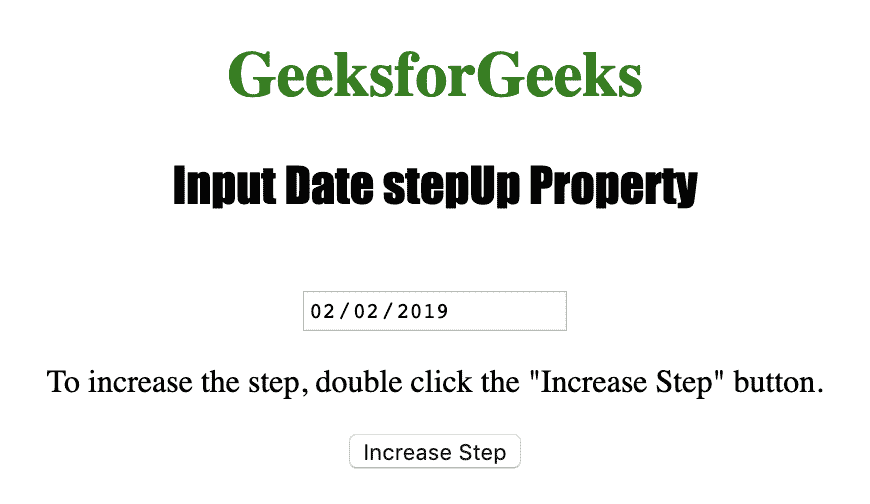
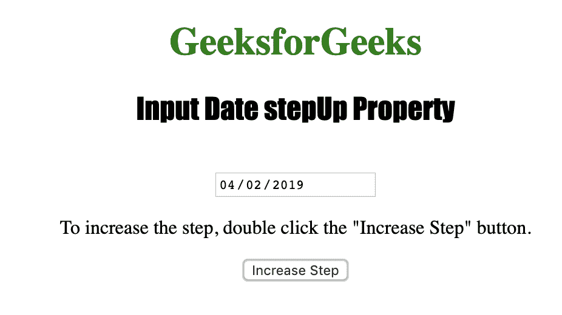

# HTML | DOM 输入日期步进()方法

> 原文:[https://www . geesforgeks . org/html-DOM-input-date-step-method/](https://www.geeksforgeeks.org/html-dom-input-date-stepup-method/)

HTML DOM 中的**输入日期步进()方法**用于将日期字段的值增加一个指定的数字。输入日期递增()方法只能用于日，不能用于月和年。

**语法:**

```html
inputdateObject.stepUp( number )
```

**参数:**该方法接受单参数**数**，用于指定日期字段应增加的天数。

下面的程序说明了在超文本标记语言中输入日期的方法:

**示例:**本示例使用 Input Date stepUp()方法将日期字段的值增加 2 天。

```html
<!DOCTYPE html>
<html>

<head> 
    <title>
        Input Date stepUp Property
    </title> 
</head>

<body style="text-align:center;">

    <h1 style="color:green;">
        GeeksforGeeks
    </h1> 

    <h2 style="text-align:center;">
        Input Date stepUp Property
    </h2>

    <input type="date" id="Test_Date">

    <p>
        To increase the step, double click
        the "Increase Step" button.
    </p>

    <button ondblclick="My_Date()">
        Increase Step
    </button>

    <!-- Script to use Input Date stepUp() Method -->
    <script>
        function My_Date() {
            document.getElementById("Test_Date").stepUp(2);
        }
    </script>
</body>

</html>                    
```

**输出:**
**点击按钮前:**

**点击按钮后:**


**支持的浏览器**

*   苹果 Safari
*   Internet Explorer 12.0
*   Firefox 17.0
*   谷歌 Chrome
*   歌剧