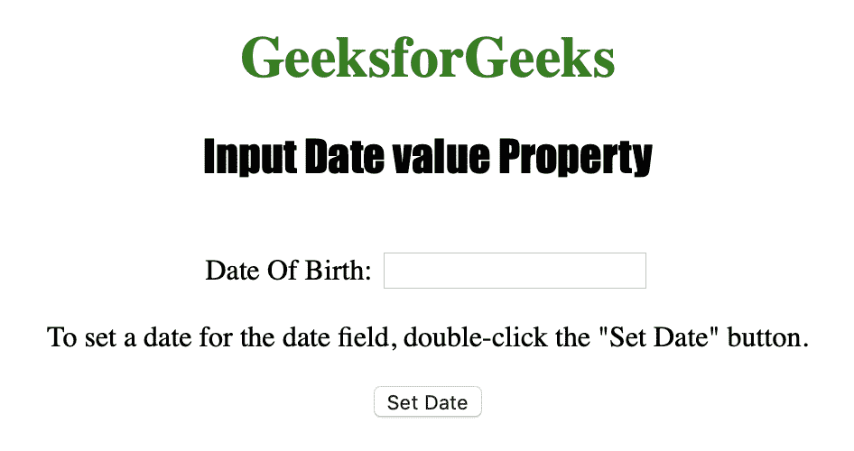
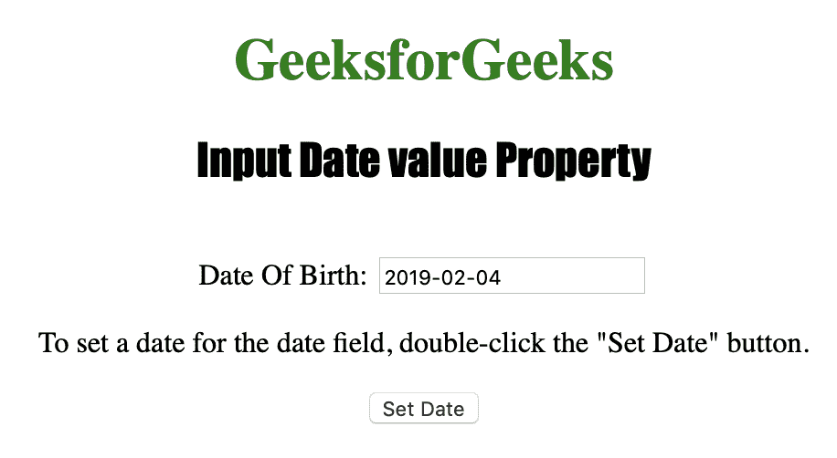
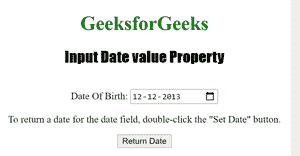
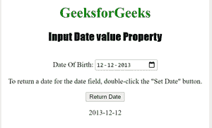

# HTML | DOM 输入日期值属性

> 原文:[https://www . geesforgeks . org/html-DOM-input-date-value-property/](https://www.geeksforgeeks.org/html-dom-input-date-value-property/)

输入日期值属性用于设置或返回日期字段的值属性的值。
输入日期值属性可用于为日期字段指定日期。
**语法:**

*   用于返回值属性:

```html
inputdateObject.value
```

*   用于设置值属性:

```html
inputdateObject.value = YYYY-MM-DD
```

**房产价值:**

*   **YYYY-MM-DD :** 用于指定日期。
    *   YYYY:指定年份。
    *   MM:指定月份。
    *   DD:它指定了一个月中的某一天。

**返回值:**返回一个字符串值，指定日期字段的日期值。

下面的程序说明了日期值属性:
**为日期时间字段设置日期。**T3】

## 超文本标记语言

```html
<!DOCTYPE html>
<html>

<head>
    <title>Input Date value Property in HTML</title>
    <style>
        h1 {
            color: green;
        }

        h2 {
            font-family: Impact;
        }

        body {
            text-align: center;
        }
    </style>
</head>

<body>

    <h1>GeeksforGeeks</h1>
    <h2>Input Date value Property</h2>
    <br> Date Of Birth:
    <input type="date" id="Test_Date">

<p>To set a date for the date field,
      double-click the "Set Date" button.</p>

    <button ondblclick="My_Date()">Set Date</button>

    <p id="test"></p>

    <script>
        function My_Date() {
            document.getElementById("Test_Date").value = "2019-02-04";
        }
    </script>

</body>
```

**输出:**



**点击**按钮后



**示例-2:** 下面的代码返回一个日期值属性。

## 超文本标记语言

```html
<!DOCTYPE html>
<html>

<head>
    <title>Input Date value Property in HTML</title>
    <style>
        h1 {
            color: green;
        }

        h2 {
            font-family: Impact;
        }

        body {
            text-align: center;
        }
    </style>
</head>

<body>

    <h1>GeeksforGeeks</h1>
    <h2>Input Date value Property</h2>
    <br> Date Of Birth:
    <input type="date" id="Test_Date" value="2013-12-12">

<p>To return a date for the date field,
    double-click the "Set Date" button.</p>

    <button ondblclick="My_Date()">Return Date</button>

    <p id="test"></p>

    <script>
        function My_Date() {
        var g =    document.getElementById("Test_Date").value;
        document.getElementById('test').innerHTML= g;

        }
    </script>

</body>
```

**之前:**



**之后:**



**支持的网络浏览器:**

*   苹果 Safari
*   微软公司出品的 web 浏览器
*   火狐浏览器
*   谷歌 Chrome
*   歌剧